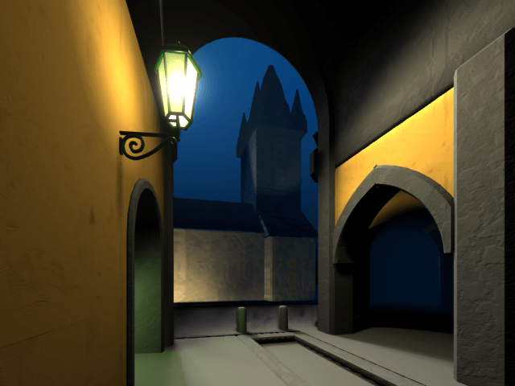

# Kafka 3D film - student-works

A 3D film done in my early days (1998), using [Lightwave 3D](https://www.lightwave3d.com/), [released at a demoparty](https://demozoo.org/productions/395201/) as a "wild compo".

