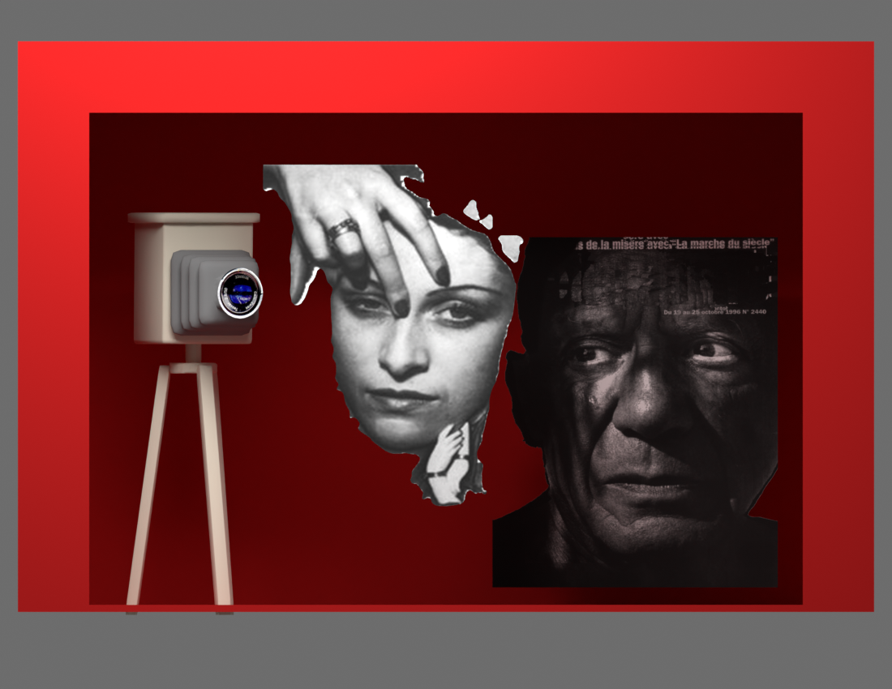

# Clip maps vers alpha cut — v0.18.0

Le convertisseur C compose désormais les clip maps d'image compatibles dans
l'alpha de la texture de couleur, puis exporte **`alphaMode: "MASK"` et
`alphaCutoff: 0.5`**. Les pixels rejetés n'écrivent pas dans le z-buffer ; les
pixels conservés sont opaques. Cela fait partie du
[cœur de glTF 2.0](https://registry.khronos.org/glTF/specs/2.0/glTF-2.0.html#alpha-coverage),
sans extension. OBJ reçoit une image d'opacité binaire via `map_d` ; son importeur
reste libre de filtrer cette image et ne garantit pas un mode alpha test.

## Cas Dora Maar : syntaxe LWSC1

La scène `content/dora-maar/dora&picasso.lws` porte trois clip maps plans :
`dora_mask.JPG`, `picass_mask.jpg` et `oeil_mask.JPG`. Les deux portraits
conservent le noir du masque ; l'œil utilise l'inversion pour conserver le blanc.
Ces attributs se trouvent dans la scène, pas dans les surfaces des `.lwo`.

L'ancienne syntaxe `ClipMap Planar Image Map / Texture...` est évaluée depuis
la v0.18.0. Ses `TextureFlags` diffèrent des `TFLG` du format LWOB :

| Bit | Sens LWSC1 |
| --- | --- |
| 1 | Coordonnées monde, préservées sans évaluation |
| 2 | Inversion du masque |
| 4 | Pixel blending |
| 8 | Antialiasing |

L'axe vient de `TextureAxis`, indépendamment de ces bits. Ces observations
proviennent de **21 imports de scènes synthétiques LWSC1 dans LightWave 9.6**,
lus par `LWTextureFuncs` avec le SDK 9. Les valeurs `TextureValue` 0, 0,5 et 1
laissent l'opacité de la couche image à 1. Ce champ reste conservé dans l'IR ;
il n'est pas utilisé comme opacité ou seuil d'export. Le test ne mesure pas le
seuil de rendu historique ni les filtres : le profil emploie un
rééchantillonnage au texel le plus proche et le seuil glTF choisi de 0,5.
[Observations natives](diagnostics/legacy-clip-parameters.json),
[sonde reproductible](../tests/probe_legacy_clips.py) et
[lecture SDK](../tests/legacy_clip_probe.h).
LightWave intervient uniquement pour cette qualification, jamais à l'exécution
du convertisseur C ou du batch ordinaire.

Le masque de Dora mesure 3,98 × 3,98 dans l'espace de l'objet, contre 4 × 4
pour la couleur, avec Mirror pour le masque et Reset pour la couleur. On
rééchantillonne donc chaque masque selon **son propre placement et son propre
wrapping**, avant de composer l'alpha. L'ajustement est enregistré séparément
dans `derived_clip_maps/bindings/mask_uv_transform` : échelles U/V, puis
décalages U/V, appliqués avant le wrapping du masque. Les coordonnées source
et les paramètres natifs ne sont pas réécrits.

Lot corrigé :
`output/qa-dora-clipmaps-20260914/batch-20260914-111125/packages/dora-maar/`.
Ouvrir **`gltf/dora&picasso.lws.gltf`** avec son `.bin` et `textures/`.
Les trois objets exportés séparément reprennent également le détourage.



Contrôles v0.18.0 :

- Trois clip maps évalués, aucun ignoré dans la scène Dora.
- Alpha vérifié indépendamment à partir des JPEG natifs et des positions sur
  les plans : écart maximal d'un niveau sur 255 entre décodeurs JPEG,
  **aucune différence de décision au seuil 0,5** sur les trois images.
- RGB et buffers de géométrie/normales/UV identiques au batch 10:42 précédent.
- Six imports isolés OBJ/glTF dans Blender : les trois branchements alpha
  sont présents dans chaque format. OBJ reçoit des `map_d` binaires.
- Régression Butterfly : ses 14 clip maps restent évalués ; ses pixels alpha,
  RGB et son buffer de géométrie sont inchangés.
- 17 glTF Dora + Butterfly validés sans erreur ni avertissement par Khronos ;
  les 18 informations concernent les images de dimensions non puissances de deux.
- 13 groupes CTest réussis en Release et avec AddressSanitizer.

Rapports : [pixels et provenance](diagnostics/dora-clipmap-qa.json),
[Blender](diagnostics/dora-clipmap-blender.json),
[Khronos](diagnostics/dora-clipmap-gltf-validation.json),
[portabilité du batch](diagnostics/dora-clipmap-layout.json),
[régression Butterfly](diagnostics/dora-butterfly-regression.json).
Le rendu de contrôle confirme le détourage, pas une équivalence d'éclairage
avec LightWave. Les lots antérieurs ne sont pas modifiés.

## Cas Butterfly — qualification v0.17.0

`content/butterfly-tank/butterfly.lwo` contient la couleur des ailes, mais son
clip map se trouve sur les instances des scènes LWS. Deux obstacles empêchaient
le détourage : ces paramètres n'étaient pas évalués, et le masque
`butterfly_clipmap.psd` est un PSD gris mono-canal que stb ne décode pas.

Un lecteur C complémentaire lit maintenant le composite des PSD gris
mono-canal, en 8 ou 16 bits, sans compression ou avec PackBits. Les sections,
dimensions et longueurs des lignes sont vérifiées avant lecture/allocation,
selon la [spécification Adobe](https://www.adobe.com/devnet-apps/photoshop/fileformatashtml/).
Les calques natifs restent archivés dans le PSD ; leur composition n'est pas
recalculée. Les PSD RGB continuent à utiliser stb. Les PSD gris avec canaux
supplémentaires, ZIP, PSB, bitmap 1 bit et flottants ne sont pas ajoutés à ce profil.

Dans les sept scènes Butterfly, `Negative 1` transforme le blanc du masque en
surface conservée. Centre, axe Y et taille de chaque projection correspondent
au matériau de son aile ; la taille négative de l'une des ailes reste respectée.

Le batch corrigé est :

`output/qa-clipmaps-20260914/batch-20260914-095021/packages/butterfly-tank/`

Ouvrir **`gltf/butterfly.lwo.gltf`**, avec son `.bin` et son dossier `textures/`.
Les anciens lots ne sont pas modifiés. La même correction fonctionne dans
les sept glTF de scène, dont `01_butterfly.lws.gltf`.


La QA du batch porte sur :

- 14 clip maps évalués dans 7 scènes ; 16 matériaux détourés, objet isolé compris.
- Alpha des PNG **identique pixel par pixel au masque PSD de 215 × 190** :
  25 454 pixels conservés et 15 396 rejetés au seuil de 0,5.
- RGB inchangé par rapport au précédent export ; buffer de géométrie, normales
  et UV du papillon également inchangé.
- 10 glTF validés par Khronos : aucune erreur ni avertissement. Les huit
  informations restantes signalent des dimensions d'image non puissances de deux.
- Imports OBJ et glTF avec leurs seuls fichiers exportés dans Blender 4.2,
  textures chargées et branchements Alpha vérifiés sur les deux matériaux.
- 13 groupes de tests passent en Release et avec AddressSanitizer, notamment
  les tests de skinning, d'IK, de normales et de projections existants.

Rapports : [pixels et provenance](diagnostics/butterfly-clipmap-qa.json),
[validateur Khronos](diagnostics/butterfly-clipmap-gltf-validation.json),
[import Blender](diagnostics/butterfly-clipmap-blender.json).
Le projet reste `partial` pour ses autres fonctions encore approximées ou
préservées, notamment certains modes de mélange. Ce contrôle ne reproduit pas
l'éclairage original LightWave.

## Portée et séparation des données

Les clip maps sont des attributs **d'instance LWS**, pas des surfaces LWO.
Le matériau natif, ses canaux et ses images ne sont pas remplacés dans l'IR.
`scene.json` conserve l'arbre de paramètres et indique les nombres de matériaux
évalués et ignorés. Les interprétations sont stockées séparément dans
`object.json/derived_clip_maps`, avec les PNG, les empreintes et les plages
d'octets des scènes sources. Les scènes et masques utilisés sont archivés sous
`IR/<objet>/clipmaps/`. Le batch conserve ces fichiers lors de la publication.

Deux instances qui diffèrent par leur clip map obtiennent des variantes de
matériau/mesh dans le glTF. Les instances identiques continuent de partager leur
mesh. Une instance sans clip map conserve son apparence ordinaire. La
transparence de surface existante continue à utiliser `BLEND` lorsqu'aucun
clip map n'est appliqué.

Pour un `.lwo` converti directement, le convertisseur examine les LWS du même
dossier et de ses descendants, puis résout leurs références à cet objet. Il
reprend une apparence détourée par matériau seulement si **toutes les
utilisations trouvées sont évaluables et produisent la même texture alpha**.
Une utilisation sans masque ou un masque différent bloque cette reprise ;
une référence ambiguë ou une scène illisible bloque l'inférence. La recherche
est limitée à 128 scènes et ne remonte pas dans les dossiers parents.
Le nom de l'image seul n'est jamais une preuve de son rôle de clip map.

Lors de la conversion d'une scène, l'aperçu séparé de ses objets emploie le
consensus des instances de cette scène. Comme pour les autres propriétés
d'aperçu, le batch publie l'objet partagé depuis sa première conversion ; les
fichiers de scène gardent leurs propres variantes. Pour examiner le consensus
de toutes les scènes voisines, convertir directement le `.lwo`.

Le seuil 0,5 est un **choix d'export**, pas une valeur native prétendument
retrouvée. La couverture est `1 - valeur_du_clip`, après `Negative`, avec une
valeur scalaire obtenue par moyenne RGB et pondération de l'alpha de l'image.
Elle multiplie l'alpha de couleur/transparence déjà dérivé. Dans ce profil
binaire, une transparence partielle peut donc être seuillée. `ObjectDissolve`
et son animation restent distincts et non évalués.

## Qualification actuelle

| Cas | Évaluation |
| --- | --- |
| `ClipMaps / TextureBlock`, une image active, mode normal à 100 % | Oui |
| Projection plane ou sphérique, axes X/Y/Z, transformation statique | Oui, alignée sur la projection existante du matériau |
| Matériau projeté d'un objet LWOB ou LWO2 | Oui |
| Repeat, Mirror, Reset, Edge | Oui si alignés ; indépendants dans le cas plan décrit ci-dessous |
| Taille ou centre différents, même axe, plans sans rotation | Oui si la couleur utilise un atlas Reset/Edge sur les deux axes, couvrant toute la géométrie |
| Autres différences de projection, matériau sans projection d'image | Préservées, sans composition |
| Projection UV explicite du clip, cubique, cylindrique, frontale | Préservées, sans évaluation par ce profil |
| Référence à un autre objet, coordonnées monde, falloff, enveloppes | Préservés, sans évaluation |
| Plusieurs couches, procédurales, gradients, modes de mélange complexes | Préservés, sans évaluation |
| Ancienne syntaxe `ClipMap Planar Image Map` suivie de `Texture...` | Oui, une image statique en coordonnées objet, axe explicite ; sphérique legacy encore préservée sans évaluation |
| Backend `.blend` natif | Différé ; le glTF exporté est importable dans Blender |

La comparaison des paramètres emploie une tolérance de 10⁻⁶ pour les écarts
d'arrondi entre le texte LWS et les flottants LWO. Aucun remeshing ni subdivision
n'est introduit. Les limites de raster du convertisseur restent applicables.
Un atlas couleur Repeat/Mirror ne peut pas recevoir arbitrairement un masque
de période différente : cette composition reste refusée, même si les axes
coïncident. Les ajustements plans ne modifient ni la géométrie ni ses UV exportés.

Code : [qualification et provenance](../src/clipmaps.c),
[composition](../src/textures.c), [PSD gris](../src/raster.c),
[tests de régression](../tests/test_clipmaps.py).

```powershell
python -X utf8 tools/batch_convert.py --project butterfly-tank --output-root output/qa-clipmaps-new
python -X utf8 tools/batch_convert.py --project dora-maar --output-root output/qa-dora-new
python -X utf8 tests/test_clipmaps.py bin/win64/lwconvert.exe
python -X utf8 documentation/diagnostics/check_butterfly_clipmap.py --project output/qa-clipmaps-20260914/batch-20260914-095021/packages/butterfly-tank --source content/butterfly-tank --baseline output/qa-projections-20260914/batch-20260914-085207/packages/butterfly-tank --report documentation/diagnostics/butterfly-clipmap-qa.json
```
