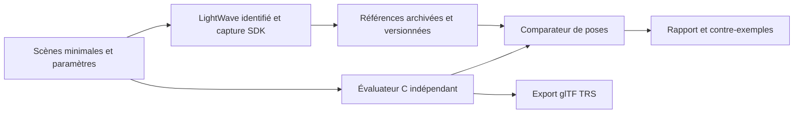

# IK LightWave : faisabilité d'une réimplémentation et roadmap

**État au 12 septembre 2026 — proposition de travail, avec mesures existantes.**

La démarche est techniquement justifiée : utiliser LightWave comme **oracle de
référence pendant la recherche**, puis remplacer son évaluation IK par un solveur
autonome dans le convertisseur. Le premier objectif proposé est la reproduction
des poses de `content/carrot_driven_robot/`, puis leur généralisation à des scènes
qui n'ont pas servi à ajuster le solveur.

La cible vérifiable est une **compatibilité de comportement avec une version
identifiée de LightWave**, sur un périmètre déclaré. Des observations finies ne
permettent pas d'identifier de manière unique le code ou l'algorithme interne
d'origine. Plusieurs méthodes peuvent donner les mêmes poses sur les cas testés.
La roadmap vise donc une implémentation explicable, mesurée et falsifiable ;
l'identité exacte avec l'algorithme propriétaire reste une hypothèse éventuelle.

L'export natif fonctionne déjà. **Le solveur IK indépendant reste à écrire.**
Cette étude complète l'[étude générale de conversion](lightwave-to-blender-feasibility.md)
et le [guide du convertisseur](converter.md).

## 1. Faisabilité et périmètre

| Objectif | Évaluation actuelle | Condition de réussite |
| --- | --- | --- |
| Interroger automatiquement LightWave et conserver les poses | Démontré sur les exports natifs actuels | Pérenniser les entrées, captures et identités des exécutables |
| Construire un banc d'expériences IK contrôlées | Réalisable avec l'infrastructure existante ; instrumentation à compléter | Vérifier les réglages effectivement chargés et l'effet de l'instrumentation |
| Reproduire une famille bornée de chaînes IK dans le C17 du convertisseur | Plausible ; résultat numérique non démontré | Réussir les essais synthétiques et les scènes réservées à la validation |
| Reproduire toute l'IK de toutes les versions de LightWave | Non établi ; périmètre trop large pour un premier engagement | Qualifier séparément versions, options, plugins et cas singuliers |
| Retrouver avec certitude l'algorithme interne exact | Non identifiable par les seules sorties finies | Exigerait d'autres preuves sur l'implémentation d'origine |

**Premier profil :** chaînes d'objets rigides et de nulls, animation de leurs
cibles, contrôleurs de rotation H/P/B, pivots et hiérarchie. Partir d'une seule
cible et ajouter les limites, la raideur et les interactions entre cibles selon
les expériences. Les configurations reconnues doivent être décrites explicitement.

Le choix du robot est utile : les deux scènes n'ont aucun bone et animent des
pièces rigides. Il permet d'étudier l'IK sans lui ajouter immédiatement le problème
des poids de déformation. `robot_night.lws` est une variante proche du même projet :
son succès ne constituera pas, à lui seul, une validation indépendante.

Le corpus [Redline : FK, IK et morphs](redline-animation-corpus.md), ajouté au
périmètre sur indication de l'utilisateur, fournit 93 LWS, dont 71 contenus
distincts. L'inventaire repère 9 scènes avec contrôleurs IK, 15 avec `MorphTarget`
et 40 avec `LW_MorphMixer` ; ces catégories se recouvrent. Il fournit des cas FK
et de morphs pour la validation. Les rigs IK proches du robot seront regroupés
avant de définir les scènes réservées ; des fichiers différents ne suffisent
pas à établir leur indépendance.

Smila viendra ensuite pour les poses de bones. Retrouver ces poses ne retrouve
pas automatiquement les influences procédurales bone/vertex. Les contraintes
éditables Blender et la subdivision restent des travaux distincts. Les cages et
les paramètres natifs restent conservés dans l'IR ; aucune subdivision en dur
n'est ajoutée au glTF dans cette démarche.

## 2. Ce qui est déjà mesuré

La référence opérationnelle est **LightWave 9.6 AMD64 ScreamerNet, build 1539**,
exécutable fourni localement dans `_tmp/_extern/LightWave/LW9.6/Programs/lwsn.exe`.
Son SHA-256 est
`bc9c125240aa6de55b58e03bb355e170161e1e0dd5207d0856986ff2256aad80`.
Cela identifie notre oracle actuel, pas nécessairement la version ayant créé
chaque scène historique.

| Mesure existante | Résultat | Ce qu'elle établit |
| --- | --- | --- |
| Export natif des deux scènes robot | 169 échantillons chacune, frames 0–168, 30 fps ; 48 pistes TRS chacune | La chaîne capture → glTF animé est opérationnelle |
| Hiérarchie exportée | 34 objets/nulls et 23 instances géométriques pour `robot` ; 26 et 15 pour `robot_night` | Les assemblages et leurs cibles sont présents |
| Vérification des cages sur toutes les frames | 1 042 899 et 537 251 positions de points comparées | Le profil rigide est justifié sur ces captures |
| Relecture Blender aux frames 0, 42, 84, 126, 168 | Écart maximal des sommets en coordonnées monde : environ `3,77e-6` et `7,69e-7` | Le glTF reproduit les poses capturées aux instants contrôlés |
| Validateur Khronos du lot natif | 19 glTF, zéro erreur et zéro avertissement | Conformité structurelle des sorties contrôlées |
| Régressions existantes Release et ASAN | 105 tests dans 7 suites pour chaque configuration | Couverture du convertisseur et du pont natif, sans qualification d'un solveur IK autonome |

Les valeurs détaillées et les limites sont archivées dans la
[QA du robot](carrot-robot-qa.md) et son
[rapport numérique](diagnostics/carrot-robot-native-qa.json). La QA Blender ne
prouve ni l'équivalence entre deux échantillons ni celle des matériaux, de
l'éclairage ou des effets de rendu natifs.

Un essai supplémentaire a comparé la frame **84** de la séquence 0–168 à deux
nouveaux processus ScreamerNet calculant chacun cette seule frame, avec la même
scène préparée et la même configuration. Le relevé initial rapporte **zéro écart
sur les 34 matrices monde et les positions des points**. Une nouvelle comparaison
des deux captures isolées confirme zéro écart sur leurs 6 171 points ; les bases,
parents et indices de polygones correspondent aussi.

Le [relevé de répétabilité](diagnostics/ik-oracle-repeatability.json) conserve le
protocole, les empreintes, les résultats et les 34 matrices d'une capture isolée.
Le lot `output/carrot-robot-native/batch-20260912-063401` a été supprimé pendant la
rédaction : la comparaison avec la séquence est reprise du rapport initial ;
seule la comparaison entre les deux captures isolées a été revérifiée ici.
Ce relevé est une preuve ponctuelle, encore insuffisante pour établir une
indépendance générale à l'historique d'évaluation ou un corpus autonome.

## 3. Instrumenter ce que LightWave interprète

Le [helper de capture](../tools/lightwave_capture/capture.c) relève actuellement
les matrices monde et les cages évaluées après un petit rendu. Le
[lanceur natif](../tools/export_lightwave_animation.py) prépare une copie de travail,
fixe les paramètres de rendu et archive les modifications. Il faut compléter
cette observation avant de choisir un solveur.

Le SDK NewTek expose, via `LWItemInfo`, les contrôleurs, la cible IK, les flags,
les bornes et leur masque d'activation, la force de cible et la raideur par axe.
Il distingue également les verrous d'interface. Ces informations permettent de
contrôler la lecture du LWS ; elles ne décrivent pas les itérations du solveur.
Voir la [documentation NewTek archivée de Item Info](https://documentation.help/LightWave/iteminfo.html).

La prochaine version du protocole de capture devra enregistrer :

- les identités source, parents, cibles et leur correspondance avec les IDs SDK ;
- les contrôleurs H/P/B, les flags de chaîne, l'activation globale de l'IK,
  les limites actives, les valeurs de raideur et de force effectivement chargées ;
- les transformations locales, pivots, rotations de pivot, temps d'évaluation,
  clés de départ et paramètres de repos pertinents ;
- l'ordre et l'identité des plugins de mouvement, ainsi que les étapes observées.

La capture de l'état global et des données temporelles devra utiliser les APIs
correspondantes du SDK ; tout n'est pas fourni par `LWItemInfo`. Une valeur absente
du fichier ne devra pas être assimilée à zéro sans vérification du défaut natif.
Un verrou de manipulation dans l'interface ne devra pas être assimilé à une
contrainte du solveur sans expérience.

Le SDK prévoit des motion handlers évalués après IK via `LWIMF_AFTERIK`, ainsi
qu'un accès aux paramètres de mouvement. C'est une piste pour comparer des étapes
avant/après IK, à qualifier sur notre hôte. Il faut vérifier ce que chaque callback
observe et démontrer qu'un observateur sans écriture ne modifie pas le résultat.
Ce mécanisme ne donne pas accès aux itérations internes. Voir
[ItemMotionHandler](https://documentation.help/LightWave/itemmot.html).

Cette vérification est particulièrement nécessaire pour le robot : chaque scène
contient six lignes concaténant une raideur et un contrôleur, par exemple
`HJointStiffness 600PController 3`. Les octets sont conservés actuellement. Le SDK
doit nous dire quels réglages LightWave a réellement retenus ; une expérience sur
une copie corrigée sera un cas différent, identifié comme tel. Même exigence pour
la résolution de `GoalObject` : vérifier sa correspondance au SDK avant de fixer
une règle d'indexation dans l'évaluateur.

## 4. Méthode expérimentale

### 4.1 Séparer les sources d'écart

La comparaison se fera d'abord dans le repère LightWave, entre matrices et poses
articulaires. Elle doit distinguer trois étages :

1. **Lecture et cinématique directe (FK)** : clés, interpolation, H/P/B, pivots,
   parents et unités. Contrôler ces résultats avec l'IK désactivée dans des copies.
2. **Résolution IK** : pose produite depuis ces entrées, contraintes et état initial.
3. **Export** : passage au repère glTF, décomposition TRS, arrondi des buffers et
   interpolation entre échantillons.

Les erreurs float32 déjà mesurées sur les cages et la relecture Blender ne sont
pas des tolérances validées pour le futur solveur. Une erreur de pivot ou d'ordre
des rotations doit être résolue au premier étage, avant de régler les paramètres
d'un algorithme IK.

### 4.2 Expériences qui départagent les hypothèses

Créer de petits LWS générés, sans plugins de mouvement externes, avec identités et
paramètres explicites. Modifier d'abord un paramètre à la fois, puis combiner les
options dont le comportement isolé est compris.

| Expérience proposée | Question à résoudre |
| --- | --- |
| Un axe libre, puis deux segments plans ; cible accessible, hors de portée, sur l'axe | Direction, choix de branche, comportement aux singularités et aux cibles inaccessibles |
| Même cible, plusieurs poses FK de départ | Initialisation depuis les clés, une pose de repos ou un autre état |
| Frames isolées répétées, séquence croissante, décroissante et permutation fixée | Dépendance à l'historique, réinitialisation et caches |
| Deux axes puis trois axes libres ; pivots non nuls et parent tourné | Composition des rotations et ordre d'évaluation |
| Limite absente, inactive, active, atteinte, puis dépassée | Sens des bornes, traitement angulaire et moment d'application des contraintes |
| Raideur 0, 1, 10, 100, puis valeurs du robot ; une articulation à la fois | Loi d'influence, saturation et éventuels effets d'échelle |
| Deux cibles concurrentes ; permutation et rapports de forces | Couplage des chaînes, priorité éventuelle et sensibilité à l'ordre |
| Chaîne et cibles uniformément redimensionnées ; translation globale | Seuils absolus/relatifs et comportement numérique |
| Parent à échelle non uniforme ou négative ; orientation de cible | Séparer les options réellement supportées et les transformations non représentables en TRS |
| Petites perturbations autour d'une pose singulière et d'une limite | Stabilité, discontinuités et choix de solution |

La documentation décrit notamment la force d'une cible comme relative aux autres
cibles de la chaîne, la raideur comme résistance à la rotation IK et l'option
d'orientation de cible comme agissant aussi sur l'échelle. Elle ne fixe pas la
fonction numérique qui combine ces effets. Voir les
[commandes de mouvement NewTek](https://documentation.help/LightWave/layout.html).

Les familles candidates comprennent la descente coordonnée de type CCD et les
méthodes fondées sur la Jacobienne, notamment les moindres carrés amortis. La
[présentation de Samuel R. Buss](https://mathweb.ucsd.edu/~sbuss/ResearchWeb/ikmethods/index.html)
fournit des méthodes de comparaison publiées. **Aucune n'est identifiée ici comme
l'algorithme de LightWave.** Une solution analytique à deux segments servira aussi
de contrôle géométrique, sans présumer du choix de branche natif.

Pour chaque candidat, expliciter l'initialisation, l'ordre des articulations et
des axes, la pondération, l'application des limites, l'amortissement et les critères
d'arrêt. Choisir les expériences suivantes là où les candidats prédisent des poses
différentes. Conserver aussi les hypothèses rejetées et leurs contre-exemples.
Si deux candidats restent indiscernables, déclarer cette limite au lieu de
présenter l'un d'eux comme l'original.

### 4.3 Mesurer une pose complète

Une extrémité qui atteint la cible ne suffit pas : les articulations intermédiaires
peuvent avoir une autre pose. Le rapport comparera toutes les articulations,
les pivots et les cibles, avec un maximum par scène et la localisation du pire cas.

| Mesure | Définition proposée |
| --- | --- |
| Erreur de position | Distance monde entre positions correspondantes, divisée par la longueur de chaîne `L` ; traiter séparément les chaînes de longueur nulle |
| Erreur d'orientation | `2 * acos(clamp(abs(dot(q_reference, q_test)), 0, 1))`, pour quaternions unitaires et rotations propres |
| Transformation complète | Écart des matrices et de points témoins ; nécessaire avec réflexion, échelle et cisaillement |
| Respect des limites | Dépassement maximal de chaque borne active, selon la convention angulaire qualifiée |
| Continuité | Sauts de branche et variation de pose entre temps proches, comparés à l'oracle |
| Coût et arrêt | Temps par évaluation, itérations du candidat et cas de non-convergence ; les itérations natives restent inconnues |

**Seuils de travail proposés, non encore qualifiés :** erreur de position relative
au plus `1e-5` et erreur angulaire au plus `1e-4` radian sur les chaînes simples
non dégénérées. Les seuils absolus, d'échelle et de limites seront fixés après
mesure du bruit de capture, puis gelés avant la validation réservée. Les cas
singuliers auront des critères explicites ; leur exclusion devra apparaître dans
le profil. Une tolérance ne sera pas élargie pour masquer un échec de validation.

L'égalité aux frames entières est un premier niveau. Pour qualifier une animation
continue, interroger ensuite des temps intermédiaires et comparer la lecture glTF
à l'oracle ; adapter l'échantillonnage si nécessaire. Les pistes TRS et leur
interpolation relèvent du
[format glTF 2.0](https://github.com/KhronosGroup/glTF/blob/main/specification/2.0/Specification.adoc#animations).

## 5. Architecture et conservation des preuves

LightWave intervient pour fabriquer ou étendre les références. Les tests ordinaires
et la conversion du profil qualifié doivent ensuite fonctionner avec les données
archivées et l'évaluateur C, sans exécutable LightWave disponible.

Chaque expérience devra conserver son générateur et sa graine éventuelle, le LWS
et les objets minimaux, les réglages demandés et observés, l'ordre des temps,
les sorties attendues et les SHA-256. Le manifeste identifiera hôte, architecture,
helper, modules, configuration, modifications de scène et protocole. Les chemins
locaux et les handles de points SDK ne devront pas devenir des identités pérennes.

La séparation entre corpus d'ajustement et corpus réservé sera enregistrée avant
le réglage final. Les fixtures synthétiques seront créées pour ce dépôt ; les
scènes historiques conserveront leur provenance et leurs sources intactes.
Le dépôt contiendra notre code et les références documentées, sans recopier les
exécutables propriétaires ni le SDK. Toute bibliothèque tierce retenue aura sa
licence et son attribution conservées ; aucune n'est choisie par cette étude.

L'IR gardera les valeurs et octets d'origine. Une vue interprétée pourra ajouter
les contrôles actifs, cibles résolues, bornes, conventions et références de preuve,
en distinguant ce qui vient du fichier, d'un défaut qualifié ou d'une observation
SDK. Un résultat dérivé indiquera le profil, la version du solveur et ses limites.

Le mode natif existant restera utilisable explicitement pour les configurations
hors profil. Une demande de conversion indépendante devra produire un diagnostic
si elle rencontre un cas non couvert ; elle ne devra pas démarrer LightWave
silencieusement.

### 5.1 Choix du mode IK pour Blender

**Choix demandé le 12 septembre 2026 :** chaque conversion `.blend` devra permettre
de choisir entre les poses IK bakées et une reconstruction utilisant l'IK native
de Blender. Les différences de résolution sont acceptées dans ce second mode.
Ce contrat concerne le futur backend Blender ; les options ne sont pas encore
implémentées.

| Mode | Entrée utilisée | Résultat attendu dans le `.blend` |
| --- | --- | --- |
| **IK bakée** (`baked`) | Poses évaluées archivées dans `evaluated-animation/`, ou produites ultérieurement par un évaluateur indépendant qualifié | Animation par clés des objets/bones, visant les poses de référence aux instants échantillonnés ; aucune contrainte IK active sur les canaux déjà bakés |
| **IK native Blender** (`native`) | Hiérarchie, pivots, clés FK, animation des cibles et paramètres IK de l'IR source | Rig éditable, cibles animées et contraintes IK résolues par Blender ; les poses peuvent différer de LightWave |

Interface proposée pour le futur lanceur : `--blend-ik baked|native`. Le choix
porte sur l'export Blender, sans changer le mode glTF ni remplacer les données
sources. L'IR conserve toujours les clés et paramètres d'origine ; les captures
évaluées restent une annexe lorsqu'elles existent. Les deux variantes pourront
être générées depuis le même paquet IR.

En mode baké, importer les transformations évaluées dans les espaces locaux
appropriés et créer une animation dérivée distincte des clés originales. Le bake
de l'IK porte sur les poses : il n'impose ni cache de sommets, ni subdivision
appliquée, ni remplacement de la cage. En l'absence de captures ou d'un évaluateur
qualifié, signaler le manque ; les seules clés FK d'origine ne constituent pas
un bake de l'IK.

En mode natif, reconstruire les chaînes, cibles et contrôles depuis l'IR. Le choix
des axes de bones, de leur orientation, du plan de flexion, des longueurs de chaîne
et des correspondances de limites/raideurs doit être documenté. Les paramètres
LightWave sans équivalent restent conservés comme métadonnées avec leur statut
d'interprétation ; ne pas assimiler leurs valeurs numériques à celles de Blender.
Les données bakées peuvent servir de référence de comparaison, mais ne doivent
pas piloter simultanément les mêmes canaux que le solveur natif.

La contrainte IK de Blender s'utilise sur une chaîne de bones et fournit notamment
une cible et une cible de pôle. Pour le robot, dont les articulations LightWave
sont des objets/nulls, prévoir une armature de contrôle dérivée qui entraîne les
pièces rigides, en conservant leurs identités et pivots. La correspondance reste
à qualifier ; aucun poids de déformation procédural n'est déduit de ce choix.
Voir le [manuel Blender 4.2 sur l'IK](https://docs.blender.org/manual/en/4.2/animation/constraints/tracking/ik_solver.html).

Le `.blend` et son manifeste devront identifier le mode choisi, la version de
Blender, le profil de traduction, les sources et les approximations. Pour un bake,
ajouter l'origine des poses, la plage, le pas et les empreintes des captures. Le
fichier livré devra se rouvrir et fonctionner avec les données et contraintes
Blender ordinaires, sans LightWave ni notre code d'import à la lecture.

**Validation adaptée au choix :** en mode baké, comparer les matrices et pivots à
la référence aux instants annoncés, puis qualifier l'interpolation. En mode natif,
vérifier le raccordement des chaînes/cibles, la modification effective de la pose
lorsqu'une cible est déplacée, les limites traduites et la stabilité du rig. Les
écarts à LightWave sont mesurés lorsqu'une référence existe et restent acceptables
au titre de ce mode ; ils ne doivent pas provoquer un basculement automatique vers
le bake. Les constructions non traduites sont signalées explicitement.

## 6. Roadmap et critères de passage

Les jalons sont ordonnés par dépendance. Leur achèvement sera attesté par les
livrables ci-dessous ; cette étude n'engage pas de date de livraison du solveur.
Un premier bilan après J2 permettra d'estimer l'effort de J3–J5 avec des mesures.

| Jalon | État | Livrable et critère de passage |
| --- | --- | --- |
| **J0 — Référence existante** | Partiellement acquis | Pont natif, QA robot et relevé de frame 84 disponibles. Constituer encore une référence rejouable hors des répertoires temporaires. |
| **J1 — Oracle instrumenté** | À faire, priorité immédiate | Protocole versionné avec réglages effectifs, identités et étapes qualifiées. Une fixture complète rejouable ; l'observateur ne change pas sa pose. |
| **J2 — Conventions et répétabilité** | À faire après J1 | Rapport FK/pivots/axes et séries isolées, croissantes, décroissantes, permutées. Décrire l'initialisation reproductible ou l'état nécessaire ; fixer les seuils de mesure. |
| **J3 — Premier solveur borné** | À faire après J2 | Candidats confrontés aux chaînes simples, puis implémentation C d'un profil à cible unique. Poses complètes conformes sur des configurations réservées ; limites du profil publiées. |
| **J4 — Contraintes et robot** | À faire après J3 | Limites, raideurs et interactions de cibles nécessaires au robot qualifiées. Comparaison des 169 frames des deux scènes, cas limites et au moins une famille réservée différente. |
| **J5 — Intégration autonome** | À faire après J4 | Lecture IR → FK/IK C → glTF, sans `--lightwave-root`. Conversion et tests dans un environnement sans LightWave ni SDK ; QA Khronos et Blender ; erreurs hors profil explicites. |
| **J6 — Extension contrôlée** | Ultérieur | Poses de bones/Smila, autres options et comparaison entre versions de LightWave, chacune avec son corpus. Influences procédurales et backend Blender suivent leurs propres critères. |

**Volet Blender B1–B3 :** il ne dépend pas de l'achèvement du solveur C de J3–J5.
Le mode baké peut consommer les captures existantes ; le mode natif interprète
l'IR source selon les conventions Blender.

| Jalon Blender | Livrable et critère de passage |
| --- | --- |
| **B1 — Import des poses bakées** | Backend IR → `.blend` avec choix de mode, transformations et clés dérivées. Réouverture dans un processus Blender neuf et comparaison des poses aux captures, sans IK appliquée deux fois. |
| **B2 — Rig avec IK native Blender** | Chaînes, cibles animées, contraintes et métadonnées issues de l'IR ; armature de contrôle pour les pièces rigides du robot. Une cible reste éditable et modifie la pose ; différences et paramètres non traduits documentés. |
| **B3 — Qualification des deux modes** | Générer deux variantes depuis le même IR, contrôler leur provenance, préserver les données originales et comparer leur animation. Tester les interactions FK/morph sur Redline lorsque ces fonctions sont qualifiées, puis les bones de Smila. |

**Volet Redline R1–R4 :** la [roadmap du corpus](redline-animation-corpus.md#volet-morph-de-la-roadmap)
prévoit les contrôles FK, les endomorphs de `work_trail.lws`, l'export autonome
des cibles/poids glTF, puis les morphs entre objets et les scènes combinant IK et
morphs. Il dépend de la qualification de l'oracle et des conventions de J1–J2,
mais peut progresser avant l'achèvement du solveur IK. Les morphs ne sont pas
assimilés à des transformations rigides ni à la récupération de poids de skin.

### J1–J2 : premier lot concret

- [ ] Étendre la capture sans casser la lecture des captures version 1 ; vérifier
  la disponibilité des APIs contre le SDK et l'hôte réellement utilisés.
- [ ] Archiver les réglages SDK des deux scènes robot, notamment les six lignes
  concaténées et les quatre relations `GoalObject` de chacune.
- [ ] Qualifier les dépendances et familles de rig de Redline ; sélectionner les
  contrôles FK et réserver les cas de validation avant l'ajustement numérique.
- [ ] Générer une chaîne à un axe et une chaîne plane à deux segments, avec
  cibles, pivots, limites et flags explicites ; inclure un cas FK de contrôle.
- [ ] Proposer une première grille de 25 positions de cible par chaîne et trois
  poses FK de départ, soit 150 configurations de base, avant variantes de limites.
  Conserver les paramètres exacts et le temps/coût des requêtes.
- [ ] Sur une animation synthétique et un sous-ensemble du robot incluant la
  frame 84, comparer trois répétitions par mode d'évaluation. Les modes inverse
  et permuté devront conserver le même processus pour tester l'historique ; des
  lancements isolés ne les remplacent pas. Qualifier ce pilotage : le wrapper
  actuel ne garantit pas l'ordre arbitraire des temps dans un même processus.
- [ ] Produire un rapport avec erreurs maximales, premiers contre-exemples,
  paramètres observés, protocole d'initialisation et décision sur le profil J3.

Ces nombres constituent un plan d'expériences, pas des essais déjà réalisés.
Si un mode n'est pas pilotable dans ScreamerNet, documenter cette limite et
qualifier un pilote Layout dédié avant d'affirmer quoi que ce soit sur ce mode.

### J3–J5 : livrer sans ajuster seulement le robot

Le prototype de comparaison peut rester en Python pour faciliter les expériences.
Le solveur retenu et ses conventions devront être portés dans le C17 du projet,
avec tests différentiels sur les mêmes références. Les principales zones de
raccordement sont [l'évaluation LWS](../src/lws.c),
[l'export glTF](../src/gltf.c) et les
[tests d'évaluation de scène](../tests/test_scene_evaluation.py).
Le [pont natif rigide](../tools/lightwave_scene.py) reste une source de référence,
sans devenir une dépendance du nouveau chemin C.

Les validations devront couvrir chaque articulation du robot, les cadres retenus
pour la validation indépendante, les refus attendus et les régressions FK déjà
supportées. La géométrie, les instances et les matériaux réutiliseront les chemins
existants. Le [contrôle Blender natif](../tests/check_native_scene_blender.py)
fournit une base pour la vérification finale ; il faut aussi qualifier les
intervalles temporels annoncés.

Le jalon J5 est terminé lorsque le convertisseur produit les deux scènes animées
avec le profil documenté dans un environnement où LightWave est indisponible,
que leurs poses passent les seuils gelés et que les cas réservés passent aussi.
La compilation Release publiera alors les binaires du convertisseur dans
`bin/win64/`, selon la convention existante. Le helper d'oracle restera optionnel.

## 7. Décisions en cas de difficulté

| Observation | Conséquence pour la roadmap |
| --- | --- |
| La pose dépend des frames précédentes | Modéliser l'état ou une procédure de remise à zéro/pré-évaluation ; adapter l'API avant J3 |
| L'instrumentation ou le chargement modifie le comportement | Corriger et requalifier l'oracle ; les nouvelles mesures ne remplacent pas silencieusement l'ancienne référence |
| Plusieurs méthodes atteignent la cible mais diffèrent sur les articulations | Ajouter des expériences discriminantes ; conserver la comparaison de pose complète |
| Un candidat fonctionne sur le robot et échoue sur les scènes réservées | Revoir l'hypothèse ou restreindre explicitement le profil ; ne pas déclarer la compatibilité générale |
| Une option reste opaque ou un plugin manque | Préserver sa description IR et signaler le cas ; le mode natif explicite reste disponible s'il sait l'évaluer |
| LW9 et LW9.6 divergent | Conserver deux références identifiées ; ne pas fusionner les sorties attendues |

La contribution de recherche pourra être formulée précisément : protocole
d'identification, corpus reproductible, hypothèses réfutées, profil compatible et
erreurs mesurées. Même un profil limité devient exploitable pour la préservation
si ses frontières et sa dépendance résiduelle à l'oracle sont explicites.
