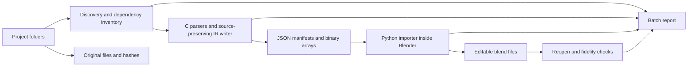

# Feasibility study: preserving the legacy LightWave projects in Blender

**Date:** 9 September 2026

**Dataset:** working-tree snapshot of `content/`, based on revision `b882a30a7220a888acaf428a6c5bbb5d53336da1`, including the added `metropolis-robots` project; individual source hashes are recorded in the inventory.

**Deliverable:** a dataset audit and an implementation proposal. The production C extractor and Blender importer have not been implemented or run.

## 1. Recommendation

**Proceed with a C extractor, an explicitly versioned intermediate representation, and a Python importer running inside Blender.** This is technically feasible for recovering the available geometry, material definitions, scene structure and much of the animation. Blender is a suitable editable destination; the original files and intermediate representation should remain the preservation master.

Do not promise identical rendering or a lossless translation of every LightWave feature into native Blender features. The actual obstacles include missing textures, old subdivision and deformation systems, renderer-specific shaders, and polygons whose topology needs special treatment. These affect this dataset, rather than being hypothetical compatibility concerns.

The most consequential findings are:

- There are **602 LightWave objects: 496 `LWOB` and 106 `LWO2`**, plus **92 scenes: 79 `LWSC 1` and 13 `LWSC 3`**, across 15 projects.
- **Implicit projections remain essential in both object families.** Explicit UVs occur in three Metropolis objects, including two with discontinuous `VMAD` data. These provide valuable real seam fixtures alongside the older projection-based materials.
- The Amiga project contains **209 LWOB objects but no detected scenes or images**. Its 174 image-reference occurrences represent 41 distinct paths after slash and case normalization, all without a local candidate.
- Points, segments, large n-gons, curves and patches are real requirements. The audit found **856 one-point records**, **5,658 two-point records**, **4,335 records with more than four vertices**, and **486 polygon/patch records containing repeated point indices**.
- Historic content paths can largely be reconstructed as project-specific aliases. One supplied batch file explicitly maps `S:` to `I:\fra\demos\jyfe`; this must not be confused with the current workspace drive.
- Six scenes contain non-ASCII bytes invalid in UTF-8. Their observed bytes cannot distinguish Windows-1252 from ISO-8859-1.

Define success as **complete accounting of source data, editable recovery where supported, and explicit reporting of every approximation or unresolved dependency**. Recovering the appearance of unavailable Amiga textures is outside what a converter can achieve from the supplied files alone.

## 2. Audit method and reproducibility

The accompanying [diagnostic scanner](diagnostics/scan_dataset.py) reads every regular file under `content/`, including hidden files, without modifying it. It identifies LightWave data by bytes, walks object chunk boundaries, inspects selected nested material chunks, counts geometry records, and extracts selected scene and image references. It also records SHA-256 hashes and inventories ZIP member names without extracting their contents.

Run from the repository root with Python 3.10 or newer; this audit used Python 3.12.5:

```powershell
python -X utf8 documentation/diagnostics/scan_dataset.py
```

The generated evidence is available in:

| File | Contents |
| --- | --- |
| [summary.json](diagnostics/summary.json) | File counts, project totals, dependency candidate totals, duplicate groups and structural warnings |
| [inventory.json](diagnostics/inventory.json) | One record per file: hash, header, detected type, geometry/chunk counts, material features and scene keywords |
| [references.json](diagnostics/references.json) | 1,248 dependency occurrences, original path bytes in hexadecimal, source byte locations, and ranked local candidates |

This is a **first-pass audit**, not a complete semantic validator. In particular, it does not evaluate shaders or animation, validate every tag association, decode image pixels, parse `CRVS` records, interpret all plugin payloads, or process archived objects. `PCHS` records were counted using the legacy polygon layout: all 25 chunks pass that structural interpretation, which also agrees with the existing [Blender LWO importer's PCHS reader](https://raw.githubusercontent.com/nangtani/blender-import-lwo/master/io_scene_lwo/lwoObject.py).

Dependency results are **candidates, not verified bindings**. This scanner ranks same-project suffix matches after slash, NFC and case normalization, using Latin-1 as a reversible display hypothesis for invalid UTF-8. It does not apply the content-root profiles proposed below, search inside ZIPs, or resolve every ancillary-file dependency. Thus its ambiguous count can decrease after root reconstruction; its dependency count can increase after deeper parsing.

The working-tree scan covers **1,384 files, 315,669,080 bytes (301.05 MiB)**, including seven `.DS_Store` metadata files. Counts below include duplicate copies and historical versions as separate files. No claim about the application's exact save version is inferred from a filename or folder label. Explicit UV maps occur only in Metropolis; the other 14 projects contain none.

## 3. What is actually in the repository

### 3.1 Per-project format inventory

| Project under `content/` | All files | LWOB | LWO2 | LWSC 1 | LWSC 3 |
| --- | ---: | ---: | ---: | ---: | ---: |
| `1st-year-student-amiga-project` | 213 | 209 | 0 | 0 | 0 |
| `eddy-the-anchoralien` | 25 | 7 | 0 | 2 | 0 |
| `gate-array-robot-head` | 32 | 6 | 0 | 1 | 0 |
| `just-another-amiga-story` | 35 | 24 | 0 | 2 | 0 |
| `lake-scenery` | 32 | 20 | 0 | 2 | 0 |
| `mandarine-000-lw5` | 93 | 24 | 27 | 2 | 1 |
| `metropolis-robots` | 266 | 0 | 6 | 0 | 3 |
| `my-village` | 17 | 2 | 7 | 0 | 1 |
| `nxng-experiments` | 517 | 153 | 50 | 56 | 2 |
| `orange-juice-signage` | 34 | 4 | 2 | 1 | 0 |
| `self-portrait-b-and-w` | 23 | 12 | 0 | 4 | 0 |
| `space-suit-000` | 37 | 22 | 3 | 6 | 3 |
| `the-tempest` | 40 | 6 | 9 | 1 | 2 |
| `toxic-waste-container` | 14 | 3 | 2 | 1 | 1 |
| `unidentified_000` | 6 | 4 | 0 | 1 | 0 |
| **Total** | **1,384** | **496** | **106** | **79** | **13** |

`LWOB` identifies the older object family, including files compatible with pre-6 LightWave. `LWO2` was introduced with LightWave 6.0. A signature alone does not distinguish LightWave 3 from 4 or 5, or LightWave 6 from later applications capable of saving LWO2. The scene version is a separate discriminator. The SDK identifies `LWSC 3` with the 6.0-and-later scene family. [Original LWOB description by Hastings and Ferguson, hosted by Paul Bourke](https://www.paulbourke.org/dataformats/lightwave/), [NewTek LWO2 specification, archived copy](https://documentation.help/LightWave/lwo2.html), [NewTek scene specification, archived copy](https://documentation.help/LightWave/lwsc.html).

No `LWO3`, `LWLO`, or `LWSC 2` signature was detected. No standalone surface-only LWOB/LWO2 file was found. **There are 1,394 embedded `SURF` chunks**, so material extraction is still substantial. The absence of a standalone surface fixture is a test-coverage gap, not a reason to omit the format from the design.

Of the 602 objects, only **391 have a `.lwo` extension**. Another **178 have no suffix**, including 176 in the Amiga project and two in `mandarine-000-lw5`; **33 have other suffixes**, such as `.l`, `.2`, `.bak`, `.wo`, or a dotted French name. Examples include `Air/Cl 1`, `Articles/WG.Rad.Mur Fenêtres` and `armure/Coquille/Courbe ceinture`. All 92 detected scenes have `.lws` extensions, but the proposed discovery stage must also recognize extensionless scenes.

### 3.2 Geometry and modeling data

The objects contain **340,833 stored points** and **415,251 parsed polygon/patch records**:

| Record family | Count | Interpretation for planning |
| --- | ---: | --- |
| LWOB `POLS` | 287,295 | Legacy polygons, including point/line records and two detail polygons |
| LWOB `PCHS` | 8,178 | Legacy patch cages in 25 files; retain their patch identity |
| LWO2 `FACE` | 113,419 | Ordinary polygon records |
| LWO2 `PTCH` | 6,337 | Subdivision cages |
| LWO2 `BONE` | 22 | Skeleton segments in `space-suit-000/BONESAGE.LWO` |

The arity totals are 856 one-point records, 5,658 two-point records, 232,073 triangles, 172,329 quads and 4,335 larger records. The two-point count includes the 22 `BONE` records; it must not be interpreted as 5,658 ordinary mesh edges. The largest polygon has 212 vertices, in `just-another-amiga-story/core/A500.LWO`.

Additional findings:

- Four Amiga objects contain `CRVS`; two have no `POLS`. A parser requiring a face chunk would reject valid modeling assets.
- `Earth/Cabine/Mec Assis` contains 919 points and neither polygons, patches nor curves. It must survive as point-only geometry.
- `just-another-amiga-story/core/AMIGA.LWO` contains two legacy detail polygons. Preserve their parent relationship rather than silently treating them as unrelated ordinary faces.
- 486 polygon/patch records repeat a point index within the same record. This is evidence requiring topology inspection, **not proof that all 486 are damaged**. Bridged holes, degenerate faces and other constructions may require different handling.
- The scanner reports 9,410 points unused by `POLS` or `PCHS`. Some belong to `CRVS`; this number is not a count of confirmed loose points.
- LWO2 objects contain 365 layers in total; 69 objects have multiple layers, with a maximum of ten. Layer order is not necessarily numeric order.
- The 38 `VMAP` chunks contain 23 `MNVW`, 12 `WGHT` and three `TXUV` maps. Two additional `VMAD` chunks contain `TXUV`. No `MORF` or `SPOT` map was found; animation morphing nevertheless exists in scenes.

Metropolis's `metropolis_model_UV.lwo`, `metropolis_model_UV_test.lwo` and `metropolis_model_UV_test_triple.lwo` contain UV map `st`, with 573, 762 and 884 point entries respectively. The latter two add 598 and 838 corner overrides. These maps are sparse relative to their objects' point counts: preserve missing values and evaluate whether the associated faces actually use the map, rather than silently substituting zero UVs.

The object scan found no FORM-size mismatch, parsed-chunk overrun or out-of-range point index in the geometry it examined. This supports parser feasibility; it does not establish that all polygons are directly representable or render identically in Blender.

### 3.3 Materials and projections

The LWOB surface scan found the following texture declarations:

| Texture declaration | Occurrences |
| --- | ---: |
| Planar Image Map | 214 |
| Cylindrical Image Map | 55 |
| Cubic Image Map | 28 |
| Spherical Image Map | 24 |
| Ripples | 5 |
| Underwater | 3 |
| Fractal Noise | 2 |
| Fractal Bumps | 2 |
| Crumple | 1 |

There are 334 `TFLG`/`TSIZ` pairs, 200 `TCTR` chunks and four `TVEL` chunks. Eighteen `TFLG` values have the legacy world-coordinate bit set. Fields such as `TWRP`, `TOPC`, `TREF`, `TALP`, `IMSQ`, `TFP*` and `TIP*` are present and need semantics beyond a texture filename.

In LWO2, the scan found 58 image-map blocks: 27 explicitly select planar projection, one spherical projection and 30 UV mapping. It also found 15 gradient blocks and 52 shader blocks. Across object families, identified shader names include **51 `LW_SuperCelShader` occurrences, two `Gaffer` occurrences and one `BRDF` occurrence**. Material conversion therefore needs a layered representation and an unsupported-shader policy.

The old material chunks also contain both integer-era fields and floating variants: for example `DIFF` and `VDIF`, `SPEC` and `VSPC`. A reader must distinguish their storage, defaults and precedence, preserving both raw values when both are present. Copying the same parsing rule between LWOB and LWO2 would be incorrect.

### 3.4 Scenes and auxiliary files

The 92 scenes contain 807 object-load statements, 619 `LoadObject` and 188 `LoadObjectLayer`. They also contain:

- 99 `AddBone` statements across five scenes;
- six scenes with `MorphTarget`/`Metamorph`;
- three scenes containing `FullTimeIK`;
- eight image-displacement declarations across three scenes;
- 32 plugin declarations across 13 scenes.

Observed plugins include `Metaform_Shaper`, `Metaform_Target`, their faster variants, `HyperVoxelsParticles`, `.HyperVoxels`, `.BRDF`, `MD_Plug`, `MD_Scan`, `Bloom` and `H/A`. Metropolis adds `.PF_DOFBlur`, `LW_Bloom`, `LW_DOFBlur` and `LW_Virtual_Darkroom2.0`, making post-processing another explicit fidelity issue. Their settings must remain available even where Blender reconstruction is partial.

The wider dataset includes:

| Data | Evidence and proposed treatment |
| --- | --- |
| Images | 75 `FORM ILBM`, 359 JPEG, 62 PSD, 17 GIF, 55 structurally identified TGA (18 uncompressed, 37 RLE), eight TIFF, two PNG, one BMP. Preserve originals; decode derivatives as required. |
| Paint projects | Four `FORM TVPP` files with `.aur` extensions. Archive them as authoring sources; do not assume their layered content is an ordinary texture. |
| Other 3D formats | Five `FORM TDDD` `.IOB` files, four `.dxf` files and one `.3ds`. Separate adapters or archival-only status; none is a LightWave object just because it is 3D data. |
| Standalone motion/envelopes | `bot.mot`, `l.mot` begin with `LWMO`; `s1.env`, `s2.env` with `LWEN`. Plan shared motion/envelope parsing and archive any channels without an assigned target. |
| MorphGizmo | `edi.giz` starts with `MORPHGIZMO`, names an anchor and target objects. A dedicated adapter can recover additional morph intent. |
| Motion Designer | `md/` contains `.mdd`, `.mds` and `.mdp`; `mdc05.lws` references `S:\md\x.mdd`. Preserve the cache and settings as a linked group. |
| Custom demo data | 31 `.moa` files with `MOA3`/`MOA4` headers; `.nxl`/`.LOnxl` files commonly begin with `FXLK`; sequence lists include `nXSQPLH`. These are not covered by the LightWave parser. |
| Image lists and reference videos | Metropolis includes `maps/robot_occ0000.ifl`, numbered TGA images, JPEG render sequences, five `.m1v` and one `.mpg` file. Preserve frame order and distinguish source animation from reference renders. |
| Archives and executables | Two ZIPs, seven AVI files and two executable-signature files. Inventory and preserve them. The converter does not need to execute the old binaries. |

`send/cosmo.zip` lists two objects and a scene as well as images; `send/bus.zip` lists an AVI. These members are **outside the 602-object/92-scene expanded-file totals**. A later archive stage should enumerate, hash and compare them with loose files before deciding whether they add new content.

A manual size probe of `md/x.mdd` reads header values 41 and 81. The usual layout hypothesis of 41 time values plus 41 arrays of 81 XYZ points predicts 40,024 bytes, while the file contains 40,996. The difference is exactly one 81-point sample (972 bytes). Determine whether this is a rest sample, a writer convention or trailing data; **do not truncate it automatically**.

## 4. Reconstructing content directories and dependencies

### 4.1 What can be inferred

The supplied scenes do not expose a `ContentDirectory`/`ContentDir` setting. Recover the relationship between saved references and the present files, rather than pretending to recover one universal original Content Folder. Current LightWave documentation describes explicit scene comments for content paths, but their availability today does not establish that these old files contain them. [LightWave scene metadata documentation](https://docs.lightwave3d.com/lw2024/customizelightwave.html).

The following are **proposed aliases inferred from actual references**. Destinations are relative to `content/`. Case and slash differences are omitted for readability; an implementation must preserve the original bytes as well.

| Project | Observed historic prefix or device | Proposed destination and confidence |
| --- | --- | --- |
| Amiga student project | `3D:Images/…`, including `Mec/Drapé Jaune.pic` and `Wood/LightWood` | `3D:` is a historic volume/assign token. The image subtree is absent; no present directory binding can be established. |
| Eddy | `odic\cc\edi\` | `eddy-the-anchoralien/`; matching `maps/blancs.iff` supports the alias. Background `perso\démos\pour OJ\white.IFF` remains unresolved. |
| Robot head | `perso\book\3d\` | `gate-array-robot-head/`; only one scene object reference supports this, so confidence is lower. |
| Amiga story | `E:\perso\démos\jaas\` | `just-another-amiga-story/`; image roots such as `L:IMAGES/` are separate and unresolved. |
| Lake | `E:\Perso\lac\`; `Objects/lacustre/`; `Images/lacustre/` | All three route to `lake-scenery/`, restricted by asset role. The corpus contains both flattened image and object paths. |
| Mandarine | `E:\fra\mandarine\3d\`; `E:fra/mandarine/3d/`; `mandarine/3d/` | `mandarine-000-lw5/`, retaining `lw5/`, `template/` and `maps/`. Strong shared-suffix evidence. |
| Metropolis | `I:fra/##3D/robots/`; `J:fra/##3D/robots/` | `metropolis-robots/`, retaining `maps/`. Both drive tokens occur in the three scenes; do not treat `#` inside a path as a comment. |
| Village | `E:fra/perso/my_village/` | `my-village/`, retaining `kid/`. `kid/face.cfg` independently references the same image subtree. |
| NXNG | `S:\` and `S:`; batch file says `subst s: I:\fra\demos\jyfe` | `nxng-experiments/`. Strongest explicit historic drive evidence, but copied scenes in `send/` or `maps_psd/` need scoped overrides where their intended assets differ. |
| Orange Juice | `E:\fra\ojuice\` | `orange-juice-signage/`, retaining `maps/`; `maps/white.iff` is absent. |
| Self portrait | `fra\book\intro\fra\`; `book pixel\brouillon\intro\fra\` | `self-portrait-b-and-w/`. Both prefixes refer to supplied object basenames. |
| Space suit | `roudoudou\3d\scaphman\` and slash form | `space-suit-000/`, retaining `META/` and `TESTMETA/`. |
| Tempest | `E:\fra\perso\tempest\` and `E:fra/perso/tempest/` | `the-tempest/`, retaining `lw5/`, `maps/` and `raws/`. |
| Toxic container | `roudoudou\3d\container\` and slash form | `toxic-waste-container/`. |
| Unidentified | `book pixel\brouillon\courbe anim\` | `unidentified_000/`; supported by both object and displacement-image references. |

These aliases identify useful project subtrees. For a relative prefix such as `mandarine/3d/`, they do not prove which parent directory had been selected as LightWave's Content Folder.

Do not run `sub.bat` to recreate its drive mapping. Its text is evidence. A virtual path resolver can apply the same historical relationship without changing the machine's drives.

### 4.2 Measured reference recovery

The audit extracts **807 object, 440 image and one plugin-data reference occurrence**. It excludes empty/`(none)` texture references and render-output filenames.

| Candidate status | Objects | Images | Plugin data | Total |
| --- | ---: | ---: | ---: | ---: |
| Unique same-project suffix, at least two components | 584 | 49 | 1 | 634 |
| Unique same-project basename only | 209 | 181 | 0 | 390 |
| Ambiguous local candidates | 12 | 23 | 0 | 35 |
| No local candidate | 2 | 187 | 0 | 189 |

The **1,024 unique candidates out of 1,248 occurrences are not an 82.1% conversion-success rate**. Repeated scene instances count repeatedly, basename matches remain hypotheses, and finding an image does not validate its pixels or its material interpretation.

The 189 occurrences without a candidate comprise 174 Amiga image references, ten image references in `just-another-amiga-story`, two Eddy background references, one Orange Juice background reference, and two NXNG object references. The NXNG scenes `gus.lws` and `run_gus.lws` request `E:\fra\roto_box\box.lwo`. A `BOX.LWO` exists in the space-suit project, but a shared basename is insufficient evidence to substitute it.

Ambiguities illustrate why the aliases matter. `S:\bus.lwo` matches root, `maps_psd/` and `send/` copies; `E:fra/perso/tempest/fridge.lwo` matches both root and `lw5/` versions. Applying the proposed exact prefix mapping favors the root files. A copied scene may need a separate explicit mapping to its bundled assets. Compare hashes and layer counts, and record the chosen interpretation instead of selecting the first recursive-search result.

The TGA layout probe resolves another false missing-texture case: `the-tempest/raws/3.iff` exists and is referenced by an LWO2 clip, but contains a 640×480, 32-bit uncompressed Targa layout. `raws/1.iff` and `raws/2.iff` have the same format mismatch. Dependency matching must therefore use detected content type as well as names.

### 4.3 Resolver design

Use a per-project manifest with optional scene/subdirectory overrides. Each rule should record the raw prefix, normalized matching form, destination, asset role, evidence, confidence and a stable rule ID.

Resolution order should be:

1. Explicit per-reference override, then the longest matching project/scene prefix rule.
2. Exact path under the configured virtual content root; role-specific `Objects`/`Images` aliases where supplied.
3. Source-file-relative candidates, considered according to the scene's provenance rather than assumed to be LightWave's original default.
4. Unique multi-component suffix within the same project.
5. Unique basename within the same project, reported at lower confidence.
6. Cross-project suggestions and filename/encoding alternatives, left unresolved until a rule establishes the relationship.

Compare exact Unicode spelling first, then NFC and case-folded forms. Preserve every collision. Do not remove accents, discard directory prefixes globally, silently fix typos such as `avbras_draoite`, or assume a drive-relative-looking `E:fra/...` string has the current operating system's semantics. An Amiga assign and a Windows drive token are both virtual namespaces until mapped.

The report should distinguish `resolved_by_rule`, `candidate_only`, `ambiguous`, `missing`, `unsupported_dependency` and `not_evaluated`. Render-output paths are provenance, not missing input assets. Additional parsers should inspect `.cfg`, `.giz`, standalone animation files and plugin blocks for dependencies not covered by this first pass.

## 5. Encoding and filenames

All 92 scene files begin with an ASCII `LWSC` header. Of their complete byte streams, **86 are ASCII-only and six are invalid UTF-8 with non-ASCII bytes**. Ninety-one use CRLF and one uses LF.

The six non-ASCII scenes are Eddy's `editestmap.lws` and `mapdroit.lws`, Amiga story's `500.lws` and `ttt.lws`, and Lake's `Lacustre.lws` and `Lacustre.2.lws`. For example, `Lacustre.2.lws` references `E:\Perso\lac\Maison_Perchée_Triplée.lwo`; its accented characters match the supplied Unicode filename when interpreted as Latin-1 or Windows-1252.

None of those six files contains bytes in `0x80–0x9F`, the range that would distinguish those two decoders. Therefore **“compatible with both Latin-1 and Windows-1252” is supported; “definitely Windows-1252” is not**. The dependency scan also finds 47 non-ASCII reference occurrences invalid in UTF-8, and 43 filesystem paths contain non-ASCII characters. An ASCII-only file does not identify its historic encoding.

The production reader should tokenize syntax as bytes, preserve byte offsets, and decode names separately. Try strict UTF-8 where appropriate, then configured legacy decoders, scoring candidates against existing filenames and project evidence. Keep ties as ties. Allow explicit overrides for both files and individual fields; do not use replacement characters or `decode(..., errors="ignore")` in the preservation path.

In the intermediate representation, store UTF-8 display text alongside the original string bytes, decoder hypothesis and confidence. On Windows, use wide-character filesystem APIs at the platform boundary rather than the current ANSI code page. Do not derive filesystem identity from a display string alone. The current Unicode filenames cannot reveal the exact bytes used for those names on the original Amiga disk; distinguish that limitation from the byte strings still preserved inside the objects.

Generated portable filenames may use a safe slug plus a stable ID. Retain the original relative path and spelling in the manifest; never rename the source corpus to make conversion easier.

## 6. What “non-destructive” should mean

Use three separate fidelity assessments for each converted feature:

| Preservation dimension | Required outcome |
| --- | --- |
| Source preservation | Original files, hashes, reference bytes and unknown payloads remain recoverable. This is achievable even for unsupported features. |
| Editable semantic recovery | Mesh connectivity, surface assignments, projection controls, hierarchy and animation remain editable with documented mappings. Coverage varies by feature. |
| Visual reproduction | Rendered appearance agrees with a reference under specified conditions. This needs comparison tests and cannot be promised for missing assets or unimplemented plugins. |

A `.blend` file by itself is insufficient evidence of all three. Keep the preservation package and make the Blender scene one derived, editable interpretation. Distinguish `preserved`, `translated`, `approximated`, `baked`, `unresolved` and `unsupported` at feature level, with reasons and source locations. Overall scene status should aggregate those records rather than label every saved file “successful.”

### 6.1 Meshes, points, lines and topology

Blender exposes vertices, edges, polygon loops and polygons, with UV data associated with loops. This supports loose geometry, n-gons and UV seams without compulsory duplication of mesh vertices. [Blender mesh data API](https://docs.blender.org/api/3.5/bpy.types.Mesh.html).

The proposed import policy is:

| LightWave construct | Editable Blender representation | Preservation condition |
| --- | --- | --- |
| Ordinary points and polygons | Mesh vertices and polygons with original point IDs attached | Preserve order; do not weld, simplify or globally triangulate. |
| Point-only object | Mesh containing vertices and no faces | The original point cloud remains accessible even if it has no renderable surface. |
| One-/two-point polygon records | Explicit point/edge records plus mesh vertices/edges | Blender face material slots do not express all point/edge material semantics. Preserve primitive IDs, surface IDs and duplicate occurrences in the IR; optional render proxies can show their appearance. |
| Valid simple n-gons | N-gons | Internal render tessellation must not replace the editable source polygon definition. |
| Repeated-index polygons or bridged holes | Original record in IR, with an identified display derivative if needed | Blender's ordinary mesh face representation cannot be assumed to preserve every such construction. Decompose only affected display geometry and retain a source-to-derived mapping. |
| Legacy detail polygons | Separate preserved parent/child relationship; display construction after inspection | Do not flatten away their meaning or infer hole semantics from the surface sign alone. |
| `CRVS` curves | Source control points, order and flags; a curve adapter or sampled display curve | Match the curve basis before claiming editable equivalence. A polyline preserves samples but not necessarily curve behavior. |
| `PCHS` and `PTCH` | Editable control cages and separately identified subdivision preview | A Blender subdivision modifier is a candidate approximation until silhouettes and limit surfaces are compared. |
| `BONE` records | Preserved skeleton topology; armature construction where meaningful | Distinguish object skeleton data from scene bone animation and deformation settings. |

Material boundaries alone do **not** require separate Blender mesh objects. Use material slots on one mesh where possible. Multiple texture channels on one material can also use different coordinate generators; “one surface equals one projection” is not a safe general assumption. The dataset contains separate color, diffuse, bump, transparency and other texture declarations.

Optional point/line thickness proxies, topology repairs and tessellations must be identifiable derivatives, not silent edits to the recovered master. Do not use automatic mesh cleanup that drops the 486 repeated-index records without reporting them.

### 6.2 Preserving implicit projection mapping

The legacy texture description stores mapping intent through the texture type and parameters such as `TFLG`, `TSIZ`, `TCTR`, `TFAL` and `TVEL`. Store these before attempting to generate UVs. [Original LWOB texture description](https://www.paulbourke.org/dataformats/lightwave/).

Create a source-aware texture graph in the IR: channel, layer order, image/procedural identity, projection, axis, coordinate system, center, size, rotation where present, reference object, animation, wrapping, inversion, filtering, opacity and falloff. Preserve absent fields separately from explicit defaults and keep unrecognized fields. This proposed graph should retain the values actually encountered rather than force them into a modern PBR material model.

For a simple static axis-aligned texture, an intermediate coordinate might be expressed as:

```text
q_i = (p_source_i - texture_center_i) / texture_size_i
uv  = projection(q, axis, wrapping, ...)
```

This is an **implementation sketch**, not a verified LightWave formula. Axis orientation, offsets, handedness, zero sizes, angular seams, image origin, wrapping and the order of transforms must be established with diagnostic images and reference output. Preserve source-space coordinates until these decisions are explicit.

Two complementary Blender outputs are useful:

- **Editable projection nodes:** a mapping group with explicit source parameters and source-coordinate reconstruction. This is the preferred representation for world-space, animated, reference-object or nonlinear mapping.
- **Derived UV layers:** optional per-corner coordinates for stable projections, making the result easy to inspect and paint. Label them as generated and retain the projection description so they can be regenerated.

Static planar projection is the best initial case. Cylindrical and spherical mappings require seam handling and pole tests. A corner UV conversion evaluates a nonlinear projection only at corners; interpolation inside a large polygon can differ from LightWave's evaluation at each shaded position. For cubic mapping, establish the face/normal selection rule and avoid introducing unrequested blending between axes. Additional tessellation or baking, if needed for appearance, belongs on a derivative.

World-space projection must continue to use world position as the object moves. Freezing it into UVs would change that behavior. The same concern applies to animated texture velocity, reference-object coordinates and deformation. Front projection should remain a capability/test target even though it was not detected in the audited object image blocks.

For LWO2 UV input, apply `VMAD` corner values over matching `VMAP` values, including discontinuous-only maps. The SDK explicitly distinguishes these mappings. Use the two Metropolis objects with `VMAD` for real seam tests, complemented by synthetic discontinuous-only and unmapped-corner cases. [NewTek LWO2 mapping specification](https://documentation.help/LightWave/lwo2.html).

Projection groups and UV-layer counts should be bounded by the pinned Blender version's tested capabilities. Avoid generating one UV map per surface indiscriminately; reuse compatible coordinate sets, or retain node-based generators when many independent projections are needed.

### 6.3 Materials, images and rendering

Build a conservative material approximation and keep the source material graph intact. Do not mechanically equate legacy glossiness with roughness, luminosity with a calibrated emission strength, or reflectivity with metallic. Preserve source scalar values and document the translation. Handle smoothing, sidedness, transparency, alpha treatment and explicit reflection images independently.

The 51 SuperCelShader occurrences make stylized shading a significant use case. `Gaffer`, `BRDF`, gradients and old procedurals need individual investigations. A Blender node group may reproduce selected behavior, but a matching name or visually similar noise node is not evidence of equivalence. Bake only as an explicitly reported option with resolution, frame, lighting and coordinate assumptions; keep editable/source alternatives available.

Plan an image-decoding stage. Blender 4.5's documented image formats include PNG, Targa, TIFF and OpenEXR, but do not list ILBM, PSD or GIF. Convert required images to supported derivatives instead of assuming every supplied texture loads natively. [Blender 4.5 supported image formats](https://docs.blender.org/UATEST/manual/en/4.5/files/media/image_formats.html).

The ILBM headers show 60 images with 24 planes, ten with eight, two with four, two with one, and one with five. Decoder coverage therefore needs more than a palette-only Amiga reader. Preserve mask/transparent-color interpretation, palette data, bitplane layout, ByteRun1 compression and pixel aspect; examine `CAMG` before choosing special display-mode handling. [Electronic Arts ILBM specification, archived with the LightWave SDK](https://documentation.help/LightWave/ilbm.html).

Eleven ILBM files trigger **a missing final padding byte after an odd-sized BODY** in the strict audit. This does not show that their pixel payload is truncated. A decoder may accept that precisely diagnosed end-of-file condition while reporting it; other boundary failures must not inherit that exception.

Keep layered PSD/TVPP documents as sources even when a flattened texture derivative is produced. Preserve animated GIF frames if referenced as animation. Record decoder version, source hash, channels, color-space assumption and derivative hash. Use PNG for integer-image derivatives and OpenEXR where floating-point data is needed. Do not silently apply Blender's display transform to stored texture pixels or assume a modern display transform reproduces the old renderer.

## 7. Scene and animation conversion

Implement separate parsers for the two scene grammars, feeding one scene model. Version 1 motion blocks and version 3 channel/envelope blocks need different readers; a global whitespace tokenizer loses filenames containing spaces and cannot preserve plugin block structure. The published version 3 SDK description is explicitly incomplete, so use it alongside actual fixtures. [NewTek scene-format description](https://documentation.help/LightWave/lwsc.html).

### 7.1 Layer and item identity

The corpus reveals a concrete indexing trap. `mandarine-000-lw5/template/perso_ak.lwo` stores layer IDs in the order **3, 0, 1, 2**, while `team.lws` requests layers **1, 2, 3, 4**. Among 129 uniquely matched loads targeting LWO2, every requested layer exists as `scene_number - 1`; 87 fail if interpreted as the raw LAYR number. Another 57 uniquely matched `LoadObjectLayer` statements target LWOB objects and request their implicit first layer.

Use those fixtures to establish a version-specific rule, preserving the scene token and object layer ID separately. Do not use physical chunk order as layer identity, and do not globally subtract one from unrelated item, polygon, surface or tag indices.

Likewise, preserve the independent addressing conventions of `ParentObject`, `ParentItem`, morph targets, bones, lights and cameras. Create stable scene-instance IDs independently of reusable object assets. A repeated object reference may share geometry while having different parenting, visibility, motion or deformation.

### 7.2 Transforms, animation and optics

Choose and document one change-of-basis matrix `C` for positions and transforms. LightWave's documented coordinate convention is left-handed and Y-up. Use matrix conjugation (`M_target = C M_source C^-1`) consistently, then validate winding, normals, pivots and local axes with an asymmetric object and animated parent/child fixtures. Do not independently swap Euler components and hope that rotations agree. [NewTek coordinate conventions](https://documentation.help/LightWave/lwo2.html).

Retain source heading/pitch/bank channels and their units. Version 1 angle values and version 3 envelope values must be interpreted using their own conventions. Preserve both frame-domain and time-domain values, scene FPS, interpolation parameters, pre/post behavior and subframe timing. Generate Blender curves only after checking the actual curve evaluator; otherwise preserve native keys and offer a sampled action with a stated sampling rate and error measurement.

Scene recovery should include hierarchy, nulls, visibility, pivots, lights, camera motion, frame ranges, lens/zoom and image aspect. Test field of view against a known framing example; copying a zoom number into a focal-length field is insufficient. Light units, attenuation, shadows, fog, backdrop, antialiasing and renderer settings may require approximations or retained metadata.

Bone rest transforms and animation can be reconstructed, but legacy influence falloff, IK solvers, compensation and Metaform behavior need separate validation. A `BoneWeightMapName` does not establish that a weight map alone determines deformation. For morph targets, preserve point order and verify topology compatibility before making shape keys. Any earlier welding or reindexing would compromise that operation.

Treat Motion Designer caches as useful recovery evidence with an explicit layout and coordinate check. Evaluate the extra sample in `x.mdd` before choosing a cache interpretation. HyperVoxels and arbitrary plugins require dedicated adapters or an `unsupported` result; saving their bytes preserves information without claiming an equivalent simulation.

## 8. Proposed implementation architecture



### 8.1 C extractor

Use a portable C17 library plus a command-line front end. Separate byte readers, format parsers, source model, path/string handling and serialization. The standalone extractor should not depend on Blender.

IFF parsing needs explicit big-endian integer/float readers, bounded sub-readers and checked arithmetic. Never overlay a host C struct on the file. Chunk lengths exclude alignment padding; child readers must not exceed parent boundaries. Preserve unknown chunks with their context and original order. [Electronic Arts IFF specification](https://documentation.help/LightWave/eaiff85.html).

The implementation checklist, based on this audit, is:

- LWOB: `PNTS`, `SRFS`, signed surface/detail-polygon records in `POLS`, `PCHS`, `CRVS`, and ordered `SURF` subchunks.
- LWO2: layers, point blocks, polygon type/flags, variable-width indices, tags/assignments, maps, clips, surfaces, envelopes and nested material blocks.
- Surface-only forms: accepted without geometry, with synthetic or externally sourced fixtures since none is present here.
- LWSC 1/3: byte-aware lines/blocks, object instances, cameras/lights, hierarchy, native motion/envelopes and opaque plugin sections.
- LWMO/LWEN: reusable channel readers; separate adapters for ancillary formats as justified by dependencies.

For LWO2, explicitly test 2-/4-byte `VX` indices, count flag masking, string padding and scoped polygon/map indices. The public specification defines those layouts. [NewTek LWO2 data types](https://documentation.help/LightWave/lwo2.html).

Use precise diagnostics containing source hash/path, byte offset or text line, chunk/block ancestry, severity and affected feature. A malformed asset must not terminate the batch. Check counts, indices, finite numbers and allocation sizes before constructing arrays. Unknown features are a supported preservation outcome, distinct from malformed input.

### 8.2 Intermediate representation

Prefer an inspectable directory package, provisionally named `LWIR`, with a small JSON manifest and typed binary arrays. The name and schema below are proposals, not an existing standard.

```text
project.lwir/
  manifest.json
  assets/<stable-id>/object.json
  assets/<stable-id>/geometry.bin
  scenes/<stable-id>/scene.json
  scenes/<stable-id>/animation.bin
  originals/<sha256>/<original-file>
  images/<stable-id>/<derivative.png>
  reports/conversion.json
```

The manifest should declare schema version, extractor version, source hashes, original paths, unit assumptions, source coordinate conventions, dependency rules and asset IDs. A portable package must either contain its originals or identify an accompanying immutable source bundle; a hash alone cannot recover an unknown chunk if the source file is lost.

Binary buffers should have a documented byte order, scalar types, alignment and bounded views. For example, positions can retain IEEE float32 precision and topology can use explicit uint32 index arrays with offsets. Keep native topology separately from any Blender-oriented derivatives. Large arrays of vertices should not be JSON lists.

An illustrative buffer descriptor:

```json
{
  "schema_version": "0.1",
  "source_coordinates": "lightwave",
  "buffers": [{"id": "g0", "uri": "geometry.bin", "byte_length": 1200}],
  "positions": {
    "buffer": "g0", "byte_offset": 0, "byte_length": 1200,
    "component_type": "float32", "byte_order": "little",
    "components": 3, "count": 100, "stride": 12
  }
}
```

This is valid example JSON, not a complete object schema. A complete schema must additionally model:

| Domain | Information that must remain explicit |
| --- | --- |
| Topology | Point blocks, ordered primitive records, arity, type, flags, original indices, surface/tag references, detail-parent links and curve/patch identity |
| Attributes | Point/corner domain, name bytes, sparse indices, map type, dimension, values and precedence |
| Materials | Ordered source channels/layers, native values, projection parameters, clip references, envelopes and opaque plugin payloads |
| Scenes | Asset references versus instances, layer IDs, hierarchy, original motion channels, evaluated derivatives and render settings |
| Provenance | Raw text/bytes, source offsets, hashes, decoding assumptions, resolver decisions and every transformation |
| Unknown data | Original byte ranges or blobs with ancestry, ordering and a reason they are not interpreted |

Validate each view's bounds, count/stride relationship and endianness, plus every cross-reference. Reject unsupported schema major versions. Retain source bytes for values that JSON cannot express faithfully, including any exceptional floating-point encodings. Small raw strings can be hexadecimal/base64; larger payloads belong in source files or binary blobs.

Do not resolve the entire source model to PBR materials, triangle lists and baked transforms before serialization: that would lose precisely the information this project is intended to preserve.

### 8.3 Blender stage

Have Blender create and save its own datablocks. Direct `.blend` writing in C is possible in principle but would introduce a separate implementation coupled to Blender's internal structures and SDNA serialization. The official DNA description explains that `.blend` data reflect low-level C layouts and embedded structure descriptions. Maintaining that writer is unjustified for this scope. [Blender DNA documentation](https://developer.blender.org/docs/features/core/dna/).

Use a pinned, recorded Blender build. **Blender 4.5 LTS is a reasonable initial qualification target**, with the exact patch and executable hash selected when implementing. This is a reproducibility choice, not a claim that it is the newest release. [Official Blender 4.5 LTS release](https://www.blender.org/releases/4-5/).

A normal Blender distribution can run in background mode; a specially compiled command-line-only build is unnecessary for the initial pipeline. The proposed invocation is:

```text
blender --background --factory-startup --disable-autoexec --python-exit-code 1 --python import_lwir.py -- --input project.lwir --output scene.blend
```

The importer path and arguments are future interfaces. Blender documents background execution and Python exception exit codes. The script would save through `bpy.ops.wm.save_as_mainfile`. [Blender command-line options](https://docs.blender.org/manual/en/3.0/advanced/command_line/arguments.html), [Blender save operator](https://docs.blender.org/api/4.5/bpy.ops.wm.html).

Prefer direct data API construction over UI-context-dependent operators, with operators reserved for operations that need them. Create meshes, loose edges/points, material slots, named projection node groups, collections, cameras, lights and animation. Put stable source IDs on Blender datablocks and embed a small provenance/report text block. Large unknown payloads remain in the preservation package.

Produce one `.blend` per scene and a browsable object library for unreferenced assets, preserving project/subfolder grouping. An Amiga collection without scenes can still become an object library. Shared object files should not force all scenes into one enormous Blender file. Use packed supported images or a managed relative asset directory, and verify portability after moving the output bundle.

### 8.4 Batch orchestration

A small Python orchestrator is appropriate for walking multiple requested roots, applying profiles, running the C extractor, scheduling image conversion and launching Blender workers. C remains the parser/extractor implementation; process management need not also be C.

Use stable asset IDs derived from source identity and content hashes. Cache parsed objects by hash, but key scene interpretations and outputs by dependency bindings, schema/importer versions, Blender build and conversion options as well. Reusing an extraction must not reuse the wrong scene-specific material or deformation result.

Write outputs into a separate staging directory, reopen and check them, then promote the completed result. Record per-stage exit codes, logs, duration and fidelity status. Use bounded worker concurrency and timeouts, resume completed work, and isolate failures by asset/scene. A batch can finish with unresolved assets, but the overall report must say so. Never overwrite the source files.

## 9. Reuse and alternatives

| Approach | Assessment for this dataset |
| --- | --- |
| C extractor + custom IR + Blender Python | **Recommended.** Separates preservation from interpretation, supports debug inspection and permits gradual recovery of unusual features. |
| Direct C `.blend` writer | Low value for the required effort; adds Blender serialization maintenance without solving LightWave semantics. |
| Existing Blender LWO importer | Useful baseline and source of fixture ideas. Its maintainers advertise LWO/LWO2, n-gons and Blender 3.3–4.5 testing, but explicitly list LWS as unsupported. It is not a complete scene-preservation pipeline. |
| Assimp via its C interface | Useful comparison reader. The implementation is C++, and its generic output does not serve as a source-preserving IR by itself. Audit any imported data before adopting it. |
| Generic interchange as the only intermediate | Evaluate only if a concrete representation preserves all required information. Extra interchange translation offers little advantage over a small explicit IR for the unusual source records identified here. |
| Automation of an original LightWave installation | Potential reference-render/evaluation path for difficult features, if a suitable installation and plugins are available. It should not be a prerequisite for recovering ordinary geometry. |

The existing [Blender LWO importer](https://github.com/nangtani/blender-import-lwo) is relevant prior work, but its inspected parser skips or only partially handles several needed properties, and its legacy string reader can ignore invalid UTF-8 bytes. Treat it as a comparison implementation rather than assuming its output meets this project's preservation contract. [Importer source](https://raw.githubusercontent.com/nangtani/blender-import-lwo/master/io_scene_lwo/lwoObject.py).

Assimp provides a C-facing interface and separate LWO/LWS loaders. Its inspected LWO code groups faces by surface and constructs new vertex arrays; therefore original point identity would need to be tracked independently. This is an architectural limitation for the proposed archival model, not a claim that every Assimp import is visually wrong. [Assimp repository](https://github.com/assimp/assimp), [LWO loader](https://raw.githubusercontent.com/assimp/assimp/master/code/AssetLib/LWO/LWOLoader.cpp), [LWS loader](https://raw.githubusercontent.com/assimp/assimp/master/code/AssetLib/LWS/LWSLoader.cpp).

Assess licenses at the exact revisions selected for reuse. No third-party parser code was copied into the diagnostic scanner, and no importer was installed or benchmarked during this study.

## 10. Implementation sequence and effort

The estimates below are **engineering judgments**, not measured throughput or delivery commitments. They assume one experienced C/Python/3D developer, access to representative reference images or a working legacy renderer for comparisons, and a scoped selection of plugin behavior.

| Stage | Concrete deliverable and exit condition | Indicative effort |
| --- | --- | --- |
| 1. Qualification fixtures and preservation contract | Reproducible audit, explicit root rules, test fixtures for unsupported-in-corpus formats, agreed fidelity reporting | 1–2 person-weeks |
| 2. C extraction and IR | Both object families and surface-only forms; original topology/bytes retained; schema validation; bounded parser tests | 3–5 person-weeks |
| 3. Editable object import | Point/edge/n-gon preservation, material slots, initial projection nodes, image derivatives and Blender reopen checks | 3–5 person-weeks |
| 4. Scene reconstruction | LWSC 1/3 instances, layers, hierarchy, transforms, cameras/lights, basic motion and standalone channels | 3–5 person-weeks |
| 5. Corpus qualification and batch delivery | All loose files accounted for, unresolved dependencies reported, targeted animation/material fixes, portable outputs and reproducible reports | 3–6 person-weeks |
| **Core preservation pipeline** | **Useful editable recovery with explicitly partial feature coverage** | **13–23 person-weeks** |

Specialized work on procedural parity, SuperCelShader, BRDF/Gaffer, Metaform, IK, HyperVoxels, custom demo formats and exceptional topology may add several weeks to several months. There is no credible fixed estimate for reproducing arbitrary plugin behavior without specifications or reference evaluation. Missing textures require source recovery, not more parser development.

Start with a **1–2 week feasibility spike contained within the early stages**: one ordinary LWOB object, one planar textured object with a present image, one mixed-generation scene, one Amiga point/line/curve case, and the layer-index fixture. Require a visible, editable `.blend`, provenance back to the original records, and an honest report. Use that result to revise the estimate before extending coverage to all projects.

The dataset's size suggests correctness and semantic compatibility will dominate the work, rather than raw byte throughput. That remains a planning inference; no C or Blender performance benchmark was run.

## 11. Validation plan and acceptance criteria

### 11.1 Representative fixtures

| Fixture | Main question it must resolve |
| --- | --- |
| Amiga `Earth/Cabine/Mec Assis` | Does a 919-point, face-free object survive? |
| Amiga `armure/Coquille/Courbe ceinture` and `Bunk/Perso/Elements Bras` | Can curves coexist with or replace faces without losing control points? |
| `just-another-amiga-story/core/A500.LWO` | Are 212-vertex polygons retained and displayed correctly? |
| `just-another-amiga-story/core/AMIGA.LWO` | Are point/line primitives, material identity and detail-polygon relationships retained? |
| `eddy-the-anchoralien/edi.lwo` and `edi_mesh.lwo` | Can legacy patches remain editable, and what does a related meshed version reveal? Do not assume it is a certified ground truth. |
| `lake-scenery/Lacustre.lws` and `Lacustre.2.lws` | Do accents and both historic path layouts resolve? Does image displacement survive? |
| `mandarine-000-lw5/template/team.lws` and `perso_ak.lwo` | Are unordered layer IDs, one-based scene layer requests and cel shading handled explicitly? |
| `space-suit-000/BONES.LWS`, `BONESAGE.LWO`, `metamate.6.lws` | Are skeletons, scene bones, weight maps and mixed LWOB/LWO2 loading distinguished? |
| `the-tempest/scene2.lws` | Are root/lw5 object variants selected correctly and disguised TGA clips found? |
| `nxng-experiments/md/mdc05.lws` and `md/x.mdd` | Is cache interpretation justified, including the extra point sample? |
| `nxng-experiments/play_room_3.lws` | Are morph targets, repeated assets and ambiguous copies preserved? |
| `metropolis-robots/metropolis_model_UV_test.lwo` and `metropolis_model_UV_test_triple.lwo` | Are sparse UVs and discontinuous corner overrides transferred without losing seams? |
| `metropolis-robots/01.lws` and `03.lws` | Do both historic drives resolve, and are DOF, bloom and darkroom post-processing reported? |
| Synthetic surface-only LWOB/LWO2, discontinuous-only UV, high VX index and projection fixtures | Cover requirements absent or insufficiently exercised in the repository. |

For synthetic texture tests, use an asymmetric labeled grid: positive/negative axes, all supported projections, transformed objects, world-space mapping, seams, poles, wrapping and texture motion. Test multiple differently mapped channels on one surface. Use matching reference frames when available; do not judge mapping correctness from a symmetric checkerboard alone.

### 11.2 Structural and numerical checks

Require unchanged original hashes, exact source primitive/point counts in the IR, complete cross-reference validation and explicit accounting of unknown bytes. Test malformed/truncated chunks, odd padding, signed detail records, `VX` thresholds, sparse/discontinuous maps, missing surfaces, unusual layer order, names with spaces/accents and path collisions. Run the C parser under memory/undefined-behavior instrumentation where available and fuzz its bounded readers.

After saving, reopen each `.blend` in a fresh Blender process. Compare source IDs, mesh counts, material assignments, hierarchy, image bindings and animation samples with the IR. Check that loose geometry and unreferenced assets have not been dropped. Compare transformed points with a declared tolerance, initially `max(1e-6 m, 1e-5 × object extent)`, then adjust only with documented numerical evidence.

For visual tests, record renderer/version, frame, resolution, camera, lights, texture derivatives and color management. Compare silhouettes, depth/normal passes and labeled projection placement before interpreting full shaded-image differences. Procedural noise, specular response and subdivision differences require feature-specific judgments. Supplied `raws/`, `bruts/` and AVI/GIF images are potential references only when their relationship to an exact scene revision and frame can be established.

### 11.3 Completion gates

The production conversion is acceptable when:

1. Every scanned input, including non-LightWave and archived content, has an explicit disposition: converted, preserved as source, unresolved, unsupported or malformed.
2. All 602 loose objects and 92 loose scenes either have output with feature-level status or a specific actionable failure; ZIP members have been separately accounted for.
3. Original topology and bytes remain recoverable regardless of whether Blender uses a display derivative.
4. No ambiguous basename or decoder tie is silently resolved, and missing assets remain visible in the report.
5. Generated Blender files reopen, retain the required editable data, and pass their declared structural/numerical checks.
6. Visual fidelity is claimed only for tested features and documented reference conditions.

For the present study, the completed work is the signature/chunk audit, path and encoding investigation, reproducible evidence files, and this design. Diagnostic checks passed for index-width boundaries, string/chunk padding, truncated chunks, a constructed detail-polygon/point/line/patch fixture, TGA packet bounds, and ambiguous/project-local path matching. The final 1,384 source hashes and file set were verified against the inventory. These checks validate the audit's implemented operations, not a future converter.

Blender was not found on `PATH`; no broader installation search or rendering experiment was performed. The proposed importer API, curve/material behavior and fidelity tolerances still require the qualification spike.

## 12. Decision

**The two-stage converter is feasible and justified by this corpus.** C is suitable for the bounded binary/text extraction, while Blender's Python API avoids maintaining a `.blend` writer and provides the desired editable destination.

The implementation should prioritize preservation of native data and reversible interpretation. Implicit projections need editable coordinate generators, with generated UVs as an optional derivative. Points, segments, large polygons, patch cages and layer identity are first-class requirements. Content roots and encoding choices belong in explicit project profiles.

The main limits to full visual reconstruction are already identifiable: absent Amiga textures, unsupported plugins/procedurals, legacy deformation/subdivision behavior, exceptional polygon topology and uncertain ancillary formats. A useful first release can recover the available artwork while retaining enough source information to improve those interpretations later.
