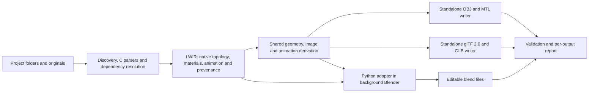

# Feasibility study: legacy LightWave to OBJ, glTF 2.0 and Blender

**Revised:** 10 September 2026 (supersedes the 9 September assessment).

**Dataset:** current `content/` working tree based on revision `e82c079b667a927a744ea24610fee97534708c43`, including staged `quatuor/` and untracked `collosus-concept-design/`. The inventory hashes, not the revision alone, identify the audited snapshot.

**Deliverable:** refreshed audit and implementation proposal, a successful synthetic background-Blender experiment, and a first C17 extraction/OBJ implementation. Current implementation scope and limits are recorded in the [converter guide](converter.md); production fidelity and the glTF/Blender backends remain unqualified or unimplemented.

## 1. Revised recommendation

**Proceed with one source-preserving extractor and intermediate representation, feeding three output backends: OBJ/MTL, glTF 2.0 and `.blend`.** Keep OBJ and glTF generation independent of Blender. Generate `.blend` through a small Python script executed by a pinned Blender executable in background mode, launched from an external Python orchestrator. No custom Blender addon, interface automation or interactive Blender session is needed.

The enlarged corpus strengthens the case for this architecture but increases the animation and material scope. It now contains **915 objects (589 LWOB, 326 LWO2), 226 scenes (98 LWSC 1, 128 LWSC 3), and two wrapped surface presets**, across **37 project directories**. UV maps now occur in **71 objects across 11 projects**. Morph maps, extensive skeletons, vertex colors, front projections and additional plugins are real requirements.

| Destination | Intended use | Main fidelity boundary | Blender required to generate it? |
| --- | --- | --- | --- |
| Wavefront `.obj` + `.mtl` + images | Widely readable geometry, including a declared static scene snapshot | No hierarchy, skeletal animation or native LightWave material graphs in the portable profile | No |
| glTF 2.0: `.gltf` + `.bin` + images, or `.glb` | Portable scenes for viewers and real-time engines, with supported animations | Derived topology, portable materials and evaluated animation; no arbitrary legacy plugin execution | No, with a direct writer |
| Blender `.blend` | Richest editable reconstruction: cages, projection controls, hierarchy, materials, recoverable animation | Translation into Blender semantics still requires validation | Yes, as a background process; no GUI or custom addon |

The originals and versioned intermediate package remain the preservation master. None of these three outputs alone can preserve all LightWave semantics. Finding a corresponding glTF or Blender feature does not establish visual or deformation equivalence.

**External Blender control has now been tested locally.** Python 3.12.5 launched the installed Blender 4.2.0, which used its bundled Python 3.11.7 to create a `.blend`. A second background process reopened it and verified geometry, a UV layer, a node material, source metadata and animation endpoints. Both processes returned zero. This establishes the automation mechanism, not LightWave conversion fidelity. See section 8.3 and the [probe result](diagnostics/blender-headless-probe.json).

The main risks remain missing dependencies, legacy deformation/subdivision and renderer-specific behavior. The expanded data also demonstrate that a matching object filename can still refer to an incompatible revision with missing layers.

## 2. Audit method and reproducibility

The [diagnostic scanner](diagnostics/scan_dataset.py) reads every regular file under `content/`, including hidden files, without modifying the sources. It detects formats by bytes, walks object chunks, counts selected geometry and map records, inspects nested material chunks, extracts selected scene/image dependencies and records SHA-256 hashes. ZIP member names are inventoried without extraction.

The revised scanner additionally recognizes Radiance HDR and RAR signatures, accepts structurally consistent uncompressed grayscale TGA, audits LightWave forms embedded in `PST_/PDAT` presets, and groups root-level metadata separately from project directories. A previously unrecognized grayscale TGA supplies six additional image-reference candidates.

Run from the repository root with Python 3.10 or newer; this run used Python 3.12.5:

```powershell
python -X utf8 documentation/diagnostics/scan_dataset.py
```

| Evidence | Contents |
| --- | --- |
| [summary.json](diagnostics/summary.json) | Current file/project counts, candidate totals, duplicates, warnings and scanner hash |
| [inventory.json](diagnostics/inventory.json) | Per-file hashes, detected formats, geometry/chunk/maps, preset payloads and scene keywords |
| [references.json](diagnostics/references.json) | 2,645 dependency occurrences, original path bytes, source byte locations and ranked candidates |
| [blender_headless_probe.py](diagnostics/blender_headless_probe.py) | Reproducible external-Python/background-Blender save/reopen experiment |
| [blender-headless-probe.json](diagnostics/blender-headless-probe.json) | Successful local probe, executable/build identity and exact test scope |

This remains a **structural audit, not a complete semantic validator**. It does not decode image pixels, evaluate animations or shaders, validate all tag/map relationships, interpret arbitrary plugin payloads or convert archive members. `CRVS` remains unparsed; LWO2 `CURV` records are counted without evaluating their curve basis. Legacy `PCHS` is counted using the legacy polygon layout; all 25 chunks pass that interpretation.

Dependency results are **candidates, not verified bindings**. The scanner ranks same-project suffixes after slash, NFC and case normalization. Latin-1 is a reversible display hypothesis for invalid UTF-8. It does not apply the proposed content-root rules or fully inspect `ISEQ`, scene `ClipMaps`/`DisplacementMaps`, `ImageEditorData`, environment plugins or plugin-specific `IMAGEFILE` fields. The measured missing count is therefore neither complete nor a conversion-success measure.

The snapshot covers **2,723 files, 1,440,000,954 bytes (1,373.29 MiB)**. Relative to the previous inventory: **1,346 paths were added, seven `.DS_Store` paths disappeared, and one existing PSD changed** (`gate-array-robot-head/robo1bit.psd`). There is now one root `.DS_Store`, outside the 37 project directories. Historical versions and duplicate files count separately. These differences predate this reassessment; source integrity is checked against the new snapshot.

## 3. What is actually in the repository

### 3.1 Per-project format inventory

| Project under `content/` | All files | LWOB | LWO2 | LWSC 1 | LWSC 3 |
| --- | ---: | ---: | ---: | ---: | ---: |
| `1st-year-student-amiga-project` | 209 | 209 | 0 | 0 | 0 |
| `aliens@newtek` | 6 | 0 | 1 | 0 | 2 |
| `berlin-250` | 13 | 2 | 3 | 2 | 0 |
| `butterfly-tank` | 15 | 0 | 3 | 0 | 7 |
| `carrot_driven_robot` | 19 | 0 | 17 | 0 | 2 |
| `circus` | 87 | 1 | 27 | 0 | 18 |
| `collosus-concept-design` | 64 | 0 | 18 | 0 | 11 |
| `cyber-bot` | 3 | 0 | 1 | 0 | 0 |
| `dora-maar` | 38 | 6 | 0 | 1 | 0 |
| `eddy-the-anchoralien` | 25 | 7 | 0 | 2 | 0 |
| `film-kafka-3d-student-works` | 147 | 61 | 0 | 12 | 0 |
| `gate-array-robot-head` | 32 | 6 | 0 | 1 | 0 |
| `giant-head` | 12 | 0 | 3 | 0 | 3 |
| `just-another-amiga-story` | 35 | 24 | 0 | 2 | 0 |
| `lake-scenery` | 32 | 20 | 0 | 2 | 0 |
| `long-road-student-project` | 10 | 5 | 0 | 1 | 0 |
| `mandarine-000-lw5` | 93 | 24 | 27 | 2 | 1 |
| `metropolis-robots` | 265 | 0 | 6 | 0 | 3 |
| `miyazaki-inspired` | 8 | 0 | 2 | 0 | 0 |
| `my-village` | 17 | 2 | 7 | 0 | 1 |
| `nxng-experiments` | 517 | 153 | 50 | 56 | 2 |
| `orange-juice-signage` | 33 | 4 | 2 | 1 | 0 |
| `planetes` | 497 | 1 | 42 | 0 | 13 |
| `quatuor` | 151 | 1 | 33 | 0 | 28 |
| `realistic-face` | 17 | 0 | 5 | 0 | 4 |
| `renault-van` | 8 | 0 | 1 | 0 | 0 |
| `self-portrait-b-and-w` | 23 | 12 | 0 | 4 | 0 |
| `sky-warps` | 91 | 0 | 5 | 0 | 2 |
| `smila-by-moebius` | 46 | 0 | 20 | 0 | 13 |
| `snow-tanks` | 84 | 16 | 24 | 3 | 8 |
| `space-suit-000` | 37 | 22 | 3 | 6 | 3 |
| `steam-mech` | 3 | 0 | 1 | 0 | 1 |
| `steam_helicopter` | 2 | 0 | 1 | 0 | 0 |
| `the-tempest` | 39 | 6 | 9 | 1 | 2 |
| `the-wreck` | 24 | 0 | 13 | 0 | 3 |
| `toxic-waste-container` | 14 | 3 | 2 | 1 | 1 |
| `unidentified_000` | 6 | 4 | 0 | 1 | 0 |
| Root metadata (`.DS_Store`) | 1 | 0 | 0 | 0 | 0 |
| **Total** | **2,723** | **589** | **326** | **98** | **128** |

`LWOB` identifies the older object family, including files compatible with pre-6 LightWave. `LWO2` was introduced with LightWave 6.0. A signature alone does not distinguish LightWave 3 from 4 or 5, or LightWave 6 from later applications capable of saving LWO2. The scene version is a separate discriminator. The SDK identifies `LWSC 3` with the 6.0-and-later scene family. [Original LWOB description by Hastings and Ferguson, hosted by Paul Bourke](https://www.paulbourke.org/dataformats/lightwave/), [NewTek LWO2 specification, archived copy](https://documentation.help/LightWave/lwo2.html), [NewTek scene specification, archived copy](https://documentation.help/LightWave/lwsc.html).

No `LWO3`, `LWLO` or `LWSC 2` was detected. A separate `FORM LXOB` occurs in `steam_helicopter/vehicle.lxo`; its header contains `modo 301 by Luxology`. It is an ancillary source requiring a separate format decision, outside the LWOB/LWO2 parser contract.

The 915 object files contain **2,354 `SURF` chunks**. Two additional `.srf` files, `planetes/mats/face.srf` and `quatuor/work/aa.srf`, are **`FORM PST_` containers whose `PDAT` embeds surface-only LWO2**, each with one `SURF` and no geometry. This closes part of the previous surface-fixture gap and makes preset unwrapping an actual requirement. The scanner records the nested forms separately: they are not two extra loose objects. One image reference inside `face.srf` has a local candidate.

Of the 915 objects, **703 have a `.lwo` suffix, 178 have none, and 34 have another suffix**. The Amiga project still contributes 209 LWOB objects without detected scenes or images. Discovery must use signatures, including for dotted French names and files with no extension. All 226 detected scenes happen to use `.lws`.

### 3.2 Geometry and modeling data

The objects contain **1,162,552 stored points** and **1,450,682 parsed primitive records**:

| Record family | Count | Interpretation |
| --- | ---: | --- |
| LWOB `POLS` | 448,588 | Includes points, lines and two legacy detail polygons |
| LWOB `PCHS` | 8,178 | Patch cages in 25 files |
| LWO2 `FACE` | 867,403 | Face-family records |
| LWO2 `PTCH` | 123,988 | Subdivision cages |
| LWO2 `BONE` | 2,514 | Object skeleton records, distinct from scene `AddBone` statements |
| LWO2 `CURV` | 11 | Curve control records; sampled curve behavior remains to be implemented |

Arity totals are 3,419 one-point, 10,179 two-point, 741,375 three-point, 687,730 four-point and 7,979 larger records. These totals include skeleton/curve/patch records; they are not all ordinary mesh faces or edges. The maximum arity is now **252**, in four Kafka objects, including `film-kafka-3d-student-works/src/porte.lwo`.

There are **1,031 records with repeated point indices**, compared with 486 previously. This requires topology investigation, not automatic deletion. The scanner finds 11,196 points unreferenced by `POLS`/`PCHS`; some belong to legacy `CRVS`. Four Amiga files contain `CRVS`, two without `POLS`, and `Earth/Cabine/Mec Assis` remains a 919-point object with no face, patch or curve chunk.

LWO2 now supplies **967 layers**, with multiple layers in 165 objects and up to 40 layers in one object. Preserve explicit layer IDs and their original order.

| Map type | VMAP chunks | VMAD chunks | Design consequence |
| --- | ---: | ---: | --- |
| `TXUV` | 216 | 181 | Sparse point UVs and corner overrides; 71 objects across 11 projects |
| `MORF` | 134 | 24 | Morph data in 58 objects; preserve point/corner domains before deriving shape keys |
| `WGHT` | 264 | 10 | Weights, including corner-domain data requiring explicit interpretation |
| `MNVW` | 178 | 39 | Modeling weights; retain independently of skinning |
| `PICK` | 81 | 0 | Selection data |
| `RGB ` | 5 | 4 | Point/corner color attributes |
| `NMBK` | 1 | 0 | Preserve raw map and context pending interpretation |

No `SPOT` map was detected. A `VMAD` can contain more than UV data: the new morph, weight and color cases invalidate an implementation specialized to `VMAD/TXUV` alone. Conflicting per-corner morph/weight values cannot be blindly collapsed onto one Blender vertex; validate their use, retain the source and split only a derived mesh if necessary.

Metropolis's original sparse `st` fixtures remain useful: 573, 762 and 884 `VMAP` entries, with 598 and 838 corner overrides in the two test variants. Add the new projects to cover morphs, colors and other map domains.

No FORM-size mismatch, parsed-object chunk overrun or out-of-range point index was detected in the geometry examined. This supports parser feasibility without proving semantic validity or render equivalence.

### 3.3 Materials, projections and images

Implicit projections remain important even though explicit UV coverage has grown. LWOB texture declarations now include 241 planar, 55 cylindrical, 51 cubic, 24 spherical and **23 front-projection image maps**. The scanner also finds Ripples, Underwater, Fractal Noise, Fractal Bumps and Crumple. There are 410 `TFLG`/`TSIZ` pairs, 220 `TCTR` chunks and four `TVEL` chunks; 52 texture flags contain the legacy world-coordinate bit.

LWO2 contains **423 image-map blocks**, with projection modes 0/1/2/3/4/5 occurring 74/47/1/50/20/231 times respectively: planar, cylindrical, spherical, cubic, front and UV. There are also **300 procedural blocks, 442 gradient blocks and 169 shader blocks**. Front projection is therefore a measured requirement in both object families, including camera-dependent behavior.

The scanner's `shader_names` field also collects procedural `FUNC` names; it is not exclusively a shader list. Examples include 51 SuperCelShader, 26 FPrime, 23 BRDF, 23 FastFresnel, 19 Baker, 15 SG_AmbOcc_Exp, three NormalShader and two Gaffer occurrences. Preserve the block class and payload before interpreting names. Existing baked textures in `the-wreck` and `collosus-concept-design` are valuable candidates for portable outputs, but their correspondence to mesh revision and UV map still needs validation.

Images now include **93 ILBM, 916 JPEG, 155 PSD, 23 GIF, 47 TIFF, 168 structurally identified TGA (91 uncompressed, 77 RLE), six PNG, two BMP and four Radiance HDR**. The TGA count includes Kafka's grayscale `mapscarabnb.TGA`, whose detection recovers six image candidates. Three Tempest files named `.iff` still contain TGA data. Extension-based loading alone would mishandle both cases.

### 3.4 Scenes and auxiliary files

The 226 scenes contain **1,974 object-load statements**: 885 `LoadObject` and 1,089 `LoadObjectLayer`. They include:

- **2,741 `AddBone` statements across 23 scenes**, versus 99 across five previously;
- 12 scenes with `MorphTarget`/`Metamorph`, plus separate MorphMixer-driven animation;
- 19 scenes containing `FullTimeIK`;
- eight legacy `DisplacementMap` declarations and 16 newer `DisplacementMaps` declarations;
- **1,781 plugin declarations across 115 scenes**.

These are occurrences across scene revisions, not unique rigs or plugins. `quatuor` alone has 1,659 `AddBone` statements and 56 MorphMixer declarations; `smila-by-moebius` adds 900 bones and extensive MotionMixer, motion-driver, expression and constraint payloads. Plugin parsing and evaluation are now a substantial scope item. Separate essential deformation/motion handlers from editor helpers and post-processing plugins instead of treating all missing plugins equally.

| Ancillary data | Current evidence and treatment |
| --- | --- |
| Surface presets | Two `PST_/PDAT/LWO2` files, audited as nested surface-only forms |
| Archives | Five ZIPs with 19 listed members; two RAR4 files detected. Archive members are outside loose object/scene totals |
| RAR spot check | 7-Zip 24.07 listing: `quatuor/work/3d/3d.rar` contains three `.lwo` and two `.lws`; `snow-tanks/NEW/obj_blob.rar` contains one `.lwo`. Contents were not extracted, hashed or compared with loose copies |
| Modo | `steam_helicopter/vehicle.lxo`, `FORM LXOB`; preserve and investigate separately |
| Other geometry | Imagine `FORM TDDD`, DXF, STL, 3DS, HRC and other ancillary files require explicit dispositions. `renault-van/obj/` has two MTL files and two STL files, but no OBJ file |
| Motion and envelopes | `bot.mot` and `l.mot` have LWMO headers; `s1.env` and `s2.env` have LWEN headers. Reuse channel readers and retain unassigned channels |
| Morph/cache data | `edi.giz` starts with `MORPHGIZMO` and names anchor/target objects. Motion Designer `.mdd`/`.mds`/`.mdp` files need a linked cache/settings interpretation; `mdc05.lws` refers to `S:/md/x.mdd` |
| Custom demo data | MOA3/MOA4, FXLK and nXSQPLH headers occur in the older NXNG data. These and added `.ahu`/`.axt` payloads need separate adapters or source-only status |
| Image sequences | Metropolis's `maps/robot_occ0000.ifl` and numbered images preserve sequence intent; distinguish animated source textures from reference renders |
| Images and references | Layered PSD/TVPP, HDR probes, rendered images and videos may support comparison once exact revision/frame relationships are established |

The existing `nxng-experiments/md/x.mdd` interpretation remains provisional. Its header values are 41 and 81; the usual layout hypothesis of 41 times plus 41 arrays of 81 XYZ points predicts 40,024 bytes, while the file contains 40,996. The extra 972 bytes equal one 81-point sample. Determine whether this is a rest sample, writer convention or trailing data, and verify mesh correspondence before using it as evaluated animation. Do not truncate it automatically. Source executables and batch files are archival evidence, not conversion dependencies.

### 3.5 What the additions change

| Finding | Previous audit | Current audit | Consequence |
| --- | --- | --- | --- |
| Project directories | 15 | 37 | Expand content-root profiles and fixture coverage |
| Loose objects / scenes | 602 / 92 | 915 / 226 | More scene interpretations and historical versions to qualify |
| Objects with UVs | 3, in Metropolis | 71, in 11 projects | glTF becomes more useful for existing textured assets; projections still need conversion |
| Native morph maps | None | 134 VMAP + 24 VMAD | Add editable morph extraction and portable morph derivatives to the planned stages |
| Object skeleton records | 22 | 2,514 | Skeleton/weight handling can no longer be an isolated edge case |
| Surface-only fixtures | None detected | Two wrapped LWO2 presets | Implement PST_ unwrapping; retain synthetic direct-form fixtures |
| Front projections | Not detected | 23 LWOB declarations + 20 LWO2 blocks | Camera-dependent mapping must be qualified explicitly |
| Missing layer requests | None among prior unique LWO2 candidates | Two in `circus/Mr_Lector_2.lws` | A unique path candidate is insufficient proof of compatible scene loading |

The verdict is **more confident for structural extraction and unattended delivery, more cautious for faithful animated reconstruction**. The new files provide better tests and expose real additional scope.

## 4. Reconstructing content directories and dependencies

### 4.1 What can be inferred

The supplied scenes do not expose a `ContentDirectory`/`ContentDir` setting. Recover the relationship between saved references and the present files, rather than pretending to recover one universal original Content Folder. Current LightWave documentation describes explicit scene comments for content paths, but their availability today does not establish that these old files contain them. [LightWave scene metadata documentation](https://docs.lightwave3d.com/lw2024/customizelightwave.html).

The following are **proposed aliases inferred from actual references**. Destinations are relative to `content/`. Case and slash differences are omitted for readability; an implementation must preserve the original bytes as well.

| Project | Observed historic prefix or device | Proposed destination and confidence |
| --- | --- | --- |
| Amiga student project | `3D:Images/…`, including `Mec/Drapé Jaune.pic` and `Wood/LightWood` | `3D:` is a historic volume/assign token. The image subtree is absent; no present directory binding can be established. |
| Eddy | `odic\cc\edi\` | `eddy-the-anchoralien/`; matching `maps/blancs.iff` supports the alias. Background `perso\démos\pour OJ\white.IFF` remains unresolved. |
| Robot head | `perso\book\3d\` | `gate-array-robot-head/`; only one scene object reference supports this, so confidence is lower. |
| Amiga story | `E:\perso\démos\jaas\` | `just-another-amiga-story/`; image roots such as `L:IMAGES/` are separate and unresolved. |
| Lake | `E:\Perso\lac\`; `Objects/lacustre/`; `Images/lacustre/` | All three route to `lake-scenery/`, restricted by asset role. The corpus contains both flattened image and object paths. |
| Mandarine | `E:\fra\mandarine\3d\`; `E:fra/mandarine/3d/`; `mandarine/3d/` | `mandarine-000-lw5/`, retaining `lw5/`, `template/` and `maps/`. Strong shared-suffix evidence. |
| Metropolis | `I:fra/##3D/robots/`; `J:fra/##3D/robots/` | `metropolis-robots/`, retaining `maps/`. Both drive tokens occur in the three scenes; do not treat `#` inside a path as a comment. |
| Village | `E:fra/perso/my_village/` | `my-village/`, retaining `kid/`. `kid/face.cfg` independently references the same image subtree. |
| NXNG | `S:\` and `S:`; batch file says `subst s: I:\fra\demos\jyfe` | `nxng-experiments/`. Strongest explicit historic drive evidence, but copied scenes in `send/` or `maps_psd/` need scoped overrides where their intended assets differ. |
| Orange Juice | `E:\fra\ojuice\` | `orange-juice-signage/`, retaining `maps/`; `maps/white.iff` is absent. |
| Self portrait | `fra\book\intro\fra\`; `book pixel\brouillon\intro\fra\` | `self-portrait-b-and-w/`. Both prefixes refer to supplied object basenames. |
| Space suit | `roudoudou\3d\scaphman\` and slash form | `space-suit-000/`, retaining `META/` and `TESTMETA/`. |
| Tempest | `E:\fra\perso\tempest\` and `E:fra/perso/tempest/` | `the-tempest/`, retaining `lw5/`, `maps/` and `raws/`. |
| Toxic container | `roudoudou\3d\container\` and slash form | `toxic-waste-container/`. |
| Unidentified | `book pixel\brouillon\courbe anim\` | `unidentified_000/`; supported by both object and displacement-image references. |

Additional profiles must account for the new projects. `quatuor/` combines `quatuor/`, `I:fra/3D/parisii/3d/` and `SHELLER/mine/3d/` references; the latter two suggest `quatuor/work/3d/`. `SHELLER/photo.lwo` has a candidate under `quatuor/work/`, while `SHELLER/meshes/monde.lwo` is absent. Do not apply a single global `SHELLER` rewrite.

For `collosus-concept-design`, `C:collosus/items/` and `C:collosus/maps/` match supplied subtrees, while scene-local `3d/` and `3d/old/` paths need separate evidence. Missing `basic_planne.lwo`, buildings and older ground revisions must remain explicit. Kafka's `E:/Perso/Praha/` references suggest its `src/` subtree; its generic `Objects/G*.lwo` character pieces are a different unresolved root. Other added projects need profiles built from their own records in `references.json`.

These aliases identify useful project subtrees. For a relative prefix such as `mandarine/3d/`, they do not prove which parent directory had been selected as LightWave's Content Folder.

Do not run `sub.bat` to recreate its drive mapping. Its text is evidence. A virtual path resolver can apply the same historical relationship without changing the machine's drives.

### 4.2 Measured reference recovery

The refreshed audit extracts **1,974 object, 670 image and one plugin-data reference occurrence**, including the image in a surface preset. Empty/`(none)` references and render-output paths are excluded.

| Candidate status | Objects | Images | Plugin data | Total |
| --- | ---: | ---: | ---: | ---: |
| Unique same-project suffix, at least two components | 1,202 | 130 | 1 | 1,333 |
| Unique same-project basename only | 627 | 256 | 0 | 883 |
| Ambiguous local candidates | 13 | 29 | 0 | 42 |
| No local candidate | 132 | 255 | 0 | 387 |

The **2,216 unique candidates out of 2,645 occurrences (83.8%) are not a conversion-success rate**. The previous 1,024/1,248 ratio measured a smaller corpus and fewer recognized input cases. Repeated references are counted repeatedly and the scan remains incomplete for nested scene/plugin dependencies.

The 387 unmatched occurrences include 174 Amiga image references, **111 Kafka references**, 34 Circus, 20 Collosus and 11 Quatuor references. Other projects account for the remaining 37. The original missing Amiga images have not appeared. Quatuor's missing `monde.lwo` and Collosus's missing scene revisions prevent complete reconstruction of the affected scenes even where most geometry is present.

Do not substitute a file solely because its basename exists elsewhere: NXNG's `E:/fra/roto_box/box.lwo` remains distinct from the space-suit project's `BOX.LWO`. Within one project, copied variants such as `S:/bus.lwo` or Tempest's root/`lw5` objects need explicit aliases, hash and layer checks.

Finding the right filename also does not establish the format. Tempest's `raws/3.iff` is a structurally identified 640×480 32-bit TGA, and Kafka's grayscale TGA requires image decoder coverage beyond the original true-color probe.

### 4.3 Resolver design

Use a per-project manifest with optional scene/subdirectory overrides. Each rule should record the raw prefix, normalized matching form, destination, asset role, evidence, confidence and a stable rule ID.

Resolution order should be:

1. Explicit per-reference override, then the longest matching project/scene prefix rule.
2. Exact path under the configured virtual content root; role-specific `Objects`/`Images` aliases where supplied.
3. Source-file-relative candidates, considered according to the scene's provenance rather than assumed to be LightWave's original default.
4. Unique multi-component suffix within the same project.
5. Unique basename within the same project, reported at lower confidence.
6. Cross-project suggestions and filename/encoding alternatives, left unresolved until a rule establishes the relationship.

Compare exact Unicode spelling first, then NFC and case-folded forms. Preserve every collision. Do not remove accents, discard directory prefixes globally, silently fix typos such as `avbras_draoite`, or assume a drive-relative-looking `E:fra/...` string has the current operating system's semantics. An Amiga assign and a Windows drive token are both virtual namespaces until mapped.

The report should distinguish `resolved_by_rule`, `candidate_only`, `ambiguous`, `missing`, `unsupported_dependency` and `not_evaluated`. Render-output paths are provenance, not missing input assets. Additional parsers should inspect `.cfg`, `.giz`, standalone animation files and plugin blocks for dependencies not covered by this first pass.

## 5. Encoding and filenames

All **226 scenes** begin with an ASCII `LWSC` header: **212 are ASCII-only and 14 contain non-ASCII bytes invalid in UTF-8**. There are 225 CRLF files and one LF file. The original six accented scenes are joined by two Circus scenes, five Kafka scenes and `long-road-student-project/la route est longue.lws`.

None of the 14 contains bytes in `0x80–0x9F`, which would distinguish Windows-1252 from ISO-8859-1. **Compatible with both is supported; definitively Windows-1252 is not.** There are 61 non-ASCII reference occurrences invalid in UTF-8 and 56 filesystem paths containing non-ASCII characters. An ASCII-only file cannot identify its historic encoding.

The production reader should tokenize syntax as bytes, preserve byte offsets, and decode names separately. Try strict UTF-8 where appropriate, then configured legacy decoders, scoring candidates against existing filenames and project evidence. Keep ties as ties. Allow explicit overrides for both files and individual fields; do not use replacement characters or `decode(..., errors="ignore")` in the preservation path.

In the intermediate representation, store UTF-8 display text alongside the original string bytes, decoder hypothesis and confidence. On Windows, use wide-character filesystem APIs at the platform boundary rather than the current ANSI code page. Do not derive filesystem identity from a display string alone. The current Unicode filenames cannot reveal the exact bytes used for those names on the original Amiga disk; distinguish that limitation from the byte strings still preserved inside the objects.

Generated portable filenames may use a safe slug plus a stable ID. Retain the original relative path and spelling in the manifest; never rename the source corpus to make conversion easier.

## 6. What “non-destructive” should mean

Use three separate fidelity assessments for each converted feature:

| Preservation dimension | Required outcome |
| --- | --- |
| Source preservation | Original files, hashes, reference bytes and unknown payloads remain recoverable. This is achievable even for unsupported features. |
| Editable semantic recovery | Mesh connectivity, surface assignments, projection controls, hierarchy and animation remain editable with documented mappings. Coverage varies by feature. |
| Visual reproduction | Rendered appearance agrees with a reference under specified conditions. This needs comparison tests and cannot be promised for missing assets or unimplemented plugins. |

A `.blend` file by itself is insufficient evidence of all three. Keep the preservation package and make the Blender scene one derived, editable interpretation. Distinguish `preserved`, `translated`, `approximated`, `baked`, `unresolved` and `unsupported` at feature level, with reasons and source locations. Overall scene status should aggregate those records rather than label every saved file “successful.”

### 6.1 Meshes, points, lines and topology

Blender exposes vertices, edges, polygon loops and polygons, with UV data associated with loops. This supports loose geometry, n-gons and UV seams without compulsory duplication of mesh vertices. [Blender mesh data API](https://docs.blender.org/api/3.5/bpy.types.Mesh.html).

The proposed import policy is:

| LightWave construct | Editable Blender representation | Preservation condition |
| --- | --- | --- |
| Ordinary points and polygons | Mesh vertices and polygons with original point IDs attached | Preserve order; do not weld, simplify or globally triangulate. |
| Point-only object | Mesh containing vertices and no faces | The original point cloud remains accessible even if it has no renderable surface. |
| One-/two-point polygon records | Explicit point/edge records plus mesh vertices/edges | Blender face material slots do not express all point/edge material semantics. Preserve primitive IDs, surface IDs and duplicate occurrences in the IR; optional render proxies can show their appearance. |
| Valid simple n-gons | N-gons | Internal render tessellation must not replace the editable source polygon definition. |
| Repeated-index polygons or bridged holes | Original record in IR, with an identified display derivative if needed | Blender's ordinary mesh face representation cannot be assumed to preserve every such construction. Decompose only affected display geometry and retain a source-to-derived mapping. |
| Legacy detail polygons | Separate preserved parent/child relationship; display construction after inspection | Do not flatten away their meaning or infer hole semantics from the surface sign alone. |
| `CRVS` curves | Source control points, order and flags; a curve adapter or sampled display curve | Match the curve basis before claiming editable equivalence. A polyline preserves samples but not necessarily curve behavior. |
| `PCHS` and `PTCH` | Editable control cages and separately identified subdivision preview | A Blender subdivision modifier is a candidate approximation until silhouettes and limit surfaces are compared. |
| `BONE` records | Preserved skeleton topology; armature construction where meaningful | Distinguish object skeleton data from scene bone animation and deformation settings. |

Material boundaries alone do **not** require separate Blender mesh objects. Use material slots on one mesh where possible. Multiple texture channels on one material can also use different coordinate generators; “one surface equals one projection” is not a safe general assumption. The dataset contains separate color, diffuse, bump, transparency and other texture declarations.

Optional point/line thickness proxies, topology repairs and tessellations must be identifiable derivatives, not silent edits to the recovered master. Do not use automatic mesh cleanup that drops the 1,031 repeated-index records without reporting them.

### 6.2 Preserving implicit projection mapping

The legacy texture description stores mapping intent through the texture type and parameters such as `TFLG`, `TSIZ`, `TCTR`, `TFAL` and `TVEL`. Store these before attempting to generate UVs. [Original LWOB texture description](https://www.paulbourke.org/dataformats/lightwave/).

Create a source-aware texture graph in the IR: channel, layer order, image/procedural identity, projection, axis, coordinate system, center, size, rotation where present, reference object, animation, wrapping, inversion, filtering, opacity and falloff. Preserve absent fields separately from explicit defaults and keep unrecognized fields. This proposed graph should retain the values actually encountered rather than force them into a modern PBR material model.

For a simple static axis-aligned texture, an intermediate coordinate might be expressed as:

```text
q_i = (p_source_i - texture_center_i) / texture_size_i
uv  = projection(q, axis, wrapping, ...)
```

This is an **implementation sketch**, not a verified LightWave formula. Axis orientation, offsets, handedness, zero sizes, angular seams, image origin, wrapping and the order of transforms must be established with diagnostic images and reference output. Preserve source-space coordinates until these decisions are explicit.

Two complementary Blender outputs are useful:

- **Editable projection nodes:** a mapping group with explicit source parameters and source-coordinate reconstruction. This is the preferred representation for world-space, animated, reference-object or nonlinear mapping.
- **Derived UV layers:** optional per-corner coordinates for stable projections, making the result easy to inspect and paint. Label them as generated and retain the projection description so they can be regenerated.

Static planar projection is the best initial case. Cylindrical and spherical mappings require seam handling and pole tests. A corner UV conversion evaluates a nonlinear projection only at corners; interpolation inside a large polygon can differ from LightWave's evaluation at each shaded position. For cubic mapping, establish the face/normal selection rule and avoid introducing unrequested blending between axes. Additional tessellation or baking, if needed for appearance, belongs on a derivative.

World-space projection must continue to use world position as the object moves. Freezing it into UVs would change that behavior. The same concern applies to animated texture velocity, reference-object coordinates and deformation. Front projection is now observed in both object families. Preserve its reference camera and projection transforms; a static UV derivative is valid only for the declared camera, geometry and frame conditions.

For LWO2 UV input, apply `VMAD` corner values over matching `VMAP` values, including discontinuous-only maps. The SDK explicitly distinguishes these mappings. Use the two Metropolis objects with `VMAD` for real seam tests, the added Collosus/Smila cases for non-UV corner maps, and synthetic discontinuous-only and unmapped-corner cases. [NewTek LWO2 mapping specification](https://documentation.help/LightWave/lwo2.html).

Projection groups and UV-layer counts should be bounded by the pinned Blender version's tested capabilities. Avoid generating one UV map per surface indiscriminately; reuse compatible coordinate sets, or retain node-based generators when many independent projections are needed.

### 6.3 Materials, images and rendering

Build a conservative material approximation and keep the source material graph intact. Do not mechanically equate legacy glossiness with roughness, luminosity with a calibrated emission strength, or reflectivity with metallic. Preserve source scalar values and document the translation. Handle smoothing, sidedness, transparency, alpha treatment and explicit reflection images independently.

The 51 SuperCelShader occurrences make stylized shading a significant use case. `Gaffer`, `BRDF`, gradients and old procedurals need individual investigations. A Blender node group may reproduce selected behavior, but a matching name or visually similar noise node is not evidence of equivalence. Bake only as an explicitly reported option with resolution, frame, lighting and coordinate assumptions; keep editable/source alternatives available.

Plan an image-decoding stage. Blender 4.5's documented image formats include PNG, Targa, TIFF and OpenEXR, but do not list ILBM, PSD or GIF. Convert required images to supported derivatives instead of assuming every supplied texture loads natively. [Blender 4.5 supported image formats](https://docs.blender.org/UATEST/manual/en/4.5/files/media/image_formats.html).

The ILBM headers show 76 images with 24 planes, 11 with eight, two with four, two with one, one with five and one with 32. The 32-plane `sky-warps/warp/sky/renders/1.iff` needs an explicit channel-layout investigation; do not assume its extra planes are alpha. Decoder coverage therefore needs more than a palette-only Amiga reader. Preserve mask/transparent-color interpretation, palette data, bitplane layout, ByteRun1 compression and pixel aspect; examine `CAMG` before choosing special display-mode handling. [Electronic Arts ILBM specification, archived with the LightWave SDK](https://documentation.help/LightWave/ilbm.html).

Thirteen ILBM files trigger **a missing final padding byte after an odd-sized BODY** in the strict audit. This does not show that their pixel payload is truncated. A decoder may accept that precisely diagnosed end-of-file condition while reporting it; other boundary failures must not inherit that exception.

Keep layered PSD/TVPP documents as sources even when a flattened texture derivative is produced. Preserve animated GIF frames if referenced as animation. Record decoder version, source hash, channels, color-space assumption and derivative hash. Use PNG for integer-image derivatives and OpenEXR where floating-point data is needed. Do not silently apply Blender's display transform to stored texture pixels or assume a modern display transform reproduces the old renderer.

## 7. Scene and animation conversion

Implement separate parsers for the two scene grammars, feeding one scene model. Version 1 motion blocks and version 3 channel/envelope blocks need different readers; a global whitespace tokenizer loses filenames containing spaces and cannot preserve plugin block structure. The published version 3 SDK description is explicitly incomplete, so use it alongside actual fixtures. [NewTek scene-format description](https://documentation.help/LightWave/lwsc.html).

### 7.1 Layer and item identity

The corpus reveals a concrete indexing trap. `mandarine-000-lw5/template/perso_ak.lwo` stores layer IDs in the order **3, 0, 1, 2**, while `team.lws` requests layers **1, 2, 3, 4**. Among 1,010 uniquely matched loads targeting LWO2, 1,008 requests exist as `scene_number - 1`; 831 fail when interpreted as the raw LAYR number. The two remaining failures are in `circus/Mr_Lector_2.lws`: it requests layers 3 and 4 of `Y:meshes/lector2.lwo`, but the supplied candidate has only layer IDs 0 and 1. Report an unavailable layer or incompatible source revision; never silently substitute another layer. Another 57 uniquely matched loads target LWOB and request the implicit first layer.

Use those fixtures to establish a version-specific rule, preserving the scene token and object layer ID separately. Do not use physical chunk order as layer identity, and do not globally subtract one from unrelated item, polygon, surface or tag indices.

Likewise, preserve the independent addressing conventions of `ParentObject`, `ParentItem`, morph targets, bones, lights and cameras. Create stable scene-instance IDs independently of reusable object assets. A repeated object reference may share geometry while having different parenting, visibility, motion or deformation.

### 7.2 Transforms, animation and optics

Choose and document one change-of-basis matrix `C` per output coordinate convention, shared by its position, normal, skeleton and transform conversion. LightWave's documented coordinate convention is left-handed and Y-up. Use matrix conjugation (`M_target = C M_source C^-1`) consistently, then validate winding, normals, pivots and local axes with an asymmetric object and animated parent/child fixtures. Do not independently swap Euler components and hope that rotations agree. [NewTek coordinate conventions](https://documentation.help/LightWave/lwo2.html).

Retain source heading/pitch/bank channels and their units. Version 1 angle values and version 3 envelope values must be interpreted using their own conventions. Preserve both frame-domain and time-domain values, scene FPS, interpolation parameters, pre/post behavior and subframe timing. Generate Blender curves only after checking the actual curve evaluator; otherwise preserve native keys and offer a sampled action with a stated sampling rate and error measurement.

Scene recovery should include hierarchy, nulls, visibility, pivots, lights, camera motion, frame ranges, lens/zoom and image aspect. Test field of view against a known framing example; copying a zoom number into a focal-length field is insufficient. Light units, attenuation, shadows, fog, backdrop, antialiasing and renderer settings may require approximations or retained metadata.

Bone rest transforms and animation can be reconstructed, but legacy influence falloff, IK solvers, compensation and Metaform behavior need separate validation. A `BoneWeightMapName` does not establish that a weight map alone determines deformation. For external morph-target objects and native MORF maps, preserve point order and verify topology compatibility before making shape keys. Resolve VMAD overrides in their original corner domain; discontinuous deltas require a deliberate derivative policy. Any earlier welding or reindexing would compromise that operation.

Treat Motion Designer caches as useful recovery evidence with an explicit layout and coordinate check. Evaluate the extra sample in `x.mdd` before choosing a cache interpretation. HyperVoxels and arbitrary plugins require dedicated adapters or an `unsupported` result; saving their bytes preserves information without claiming an equivalent simulation.

## 8. Proposed implementation architecture



The Python orchestrator runs stages as subprocesses. Blender is required for the `.blend` branch and optional Blender-based rendering/baking jobs. A normal OBJ/glTF batch must be able to run with no Blender executable installed.

Share dependency resolution, coordinate conversion, projection evaluation, tessellation and animation sampling before serialization. Each writer selects its declared output profile from that common model. Do not independently reimplement LightWave interpretation three times.

### 8.1 C extractor

Use a portable C17 library plus a command-line front end. Separate byte readers, format parsers, source model, path/string handling and serialization. The standalone extractor should not depend on Blender.

IFF parsing needs explicit big-endian integer/float readers, bounded sub-readers and checked arithmetic. Never overlay a host C struct on the file. Chunk lengths exclude alignment padding; child readers must not exceed parent boundaries. Preserve unknown chunks with their context and original order. [Electronic Arts IFF specification](https://documentation.help/LightWave/eaiff85.html).

The implementation checklist, based on this audit, is:

- LWOB: `PNTS`, `SRFS`, signed surface/detail-polygon records in `POLS`, `PCHS`, `CRVS`, and ordered `SURF` subchunks.
- LWO2: layers, point blocks, polygon type/flags, variable-width indices, tags/assignments, all observed point/corner map domains, clips including sequences, surfaces, envelopes and nested material blocks.
- Surface-only forms: accept bare LWOB/LWO2 and unwrap PST_/PDAT; use the two supplied presets and synthetic bare-form fixtures.
- LWSC 1/3: byte-aware lines/blocks, object instances, cameras/lights, hierarchy, native motion/envelopes and opaque plugin sections.
- LWMO/LWEN: reusable channel readers; separate adapters for ancillary formats as justified by dependencies.

For LWO2, explicitly test 2-/4-byte `VX` indices, count flag masking, string padding and scoped polygon/map indices. The public specification defines those layouts. [NewTek LWO2 data types](https://documentation.help/LightWave/lwo2.html).

Use precise diagnostics containing source hash/path, byte offset or text line, chunk/block ancestry, severity and affected feature. A malformed asset must not terminate the batch. Check counts, indices, finite numbers and allocation sizes before constructing arrays. Unknown features are a supported preservation outcome, distinct from malformed input.

### 8.2 Intermediate representation

Prefer an inspectable directory package, provisionally named `LWIR`, with a small JSON manifest and typed binary arrays. The implementation uses readable source filenames and groups files by format under each project. Since converter v0.2.0, the batch layout is:

```text
packages/<project>/
  manifest.json
  obj/<object filename>.obj
  obj/<object filename>.mtl
  obj/<scene filename>.obj
  obj/<scene filename>.mtl
  IR/<object filename>/manifest.json
  IR/<object filename>/object.json
  IR/<object filename>/geometry.bin
  IR/<object filename>/source.bin
  IR/<scene filename>/manifest.json
  IR/<scene filename>/scene.json
  IR/<scene filename>/animation.bin
  IR/<scene filename>/source.bin
  gltf/<object filename>.gltf
  gltf/<object filename>.bin
  gltf/<scene filename>.gltf
  gltf/<scene filename>.bin
  blender/                      # Reserved for future .blend exports
```

Original extensions remain part of export names, such as `Tour_Toit.lwo.obj` and `Tour_Toit.lwo.gltf`. Numeric suffixes are added only for name collisions; SHA-256 identities remain in metadata. Each native source and its binary arrays have a separate IR directory, and scene dependencies are shared within a project. Since v0.3.0, the glTF directory contains static geometry exports; only Blender output remains unimplemented. See the [converter guide](converter.md) for the naming rules, relative URIs and versioned layout. This is a project-specific representation, not an existing standard.

The manifest should declare schema version, extractor version, source hashes, original paths, unit assumptions, source coordinate conventions, dependency rules and asset IDs. A portable package must either contain its originals or identify an accompanying immutable source bundle; a hash alone cannot recover an unknown chunk if the source file is lost.

Binary buffers should have a documented byte order, scalar types, alignment and bounded views. For example, positions can retain IEEE float32 precision and topology can use explicit uint32 index arrays with offsets. Keep native topology separately from any target-specific derivatives; record source-to-output point/corner/primitive mappings for all three writers. Large arrays of vertices should not be JSON lists.

An illustrative buffer descriptor:

```json
{
  "schema_version": "0.1",
  "source_coordinates": "lightwave",
  "buffers": [{"id": "g0", "uri": "geometry.bin", "byte_length": 1200}],
  "positions": {
    "buffer": "g0", "byte_offset": 0, "byte_length": 1200,
    "component_type": "float32", "byte_order": "little",
    "components": 3, "count": 100, "stride": 12
  }
}
```

This is valid example JSON, not a complete object schema. A complete schema must additionally model:

| Domain | Information that must remain explicit |
| --- | --- |
| Topology | Point blocks, ordered primitive records, arity, type, flags, original indices, surface/tag references, detail-parent links and curve/patch identity |
| Attributes | Point/corner domain, name bytes, sparse indices, map type, dimension, values and precedence |
| Materials | Ordered source channels/layers, native values, projection parameters, clip references, envelopes and opaque plugin payloads |
| Scenes | Asset references versus instances, layer IDs, hierarchy, original motion channels, evaluated derivatives and render settings |
| Provenance | Raw text/bytes, source offsets, hashes, decoding assumptions, resolver decisions and every transformation |
| Unknown data | Original byte ranges or blobs with ancestry, ordering and a reason they are not interpreted |

Validate each view's bounds, count/stride relationship and endianness, plus every cross-reference. Reject unsupported schema major versions. Retain source bytes for values that JSON cannot express faithfully, including any exceptional floating-point encodings. Small raw strings can be hexadecimal/base64; larger payloads belong in source files or binary blobs.

Do not resolve the entire source model to PBR materials, triangle lists and baked transforms before serialization: that would lose precisely the information this project is intended to preserve.

### 8.3 Blender without an addon or GUI

**Recommended integration: an external Python program launches Blender, and Blender executes a regular Python script using `bpy`.** The script is a conversion backend, with no panel, operator registration, installation into user preferences or addon lifecycle. The resulting scene should use ordinary datablocks and native node groups, so opening the `.blend` does not require our code or a custom Python driver.

Python on the host orchestrates the job; the Blender-specific script runs in Blender's bundled interpreter. The two Python versions need not match when their interface is files and process arguments. This was verified with external Python 3.12.5 and embedded Python 3.11.7.

A future invocation is:

```text
blender --background --factory-startup --disable-autoexec --python-exit-code 1 --python build_blend.py -- --input project.lwir --output scene.blend
```

`build_blend.py` and its arguments are proposed interfaces, not an implemented converter. Background execution and Python-script exit codes are documented by Blender. Keep argument order explicit; parameters after `--` belong to our script. [Blender command-line documentation](https://docs.blender.org/manual/fr/4.5/advanced/command_line/arguments.html).

An external launcher can use:

```python
import subprocess

subprocess.run(
    [blender_exe, "--background", "--factory-startup", "--disable-autoexec",
     "--python-exit-code", "1", "--python", adapter_script, "--",
     "--input", ir_path, "--output", blend_path],
    check=True, timeout=300,
)
```

The path variables are supplied by the orchestrator. Pass an argument list without a shell, collect stdout/stderr and set a per-job timeout. On Windows, the supplied probe also uses `CREATE_NO_WINDOW` to avoid a console window.

Prefer `bpy.data` construction for meshes, UVs, materials, collections, cameras, lights and animation. Reserve context-dependent operators for necessary operations, explicitly setting their context when required. Saving uses `bpy.ops.wm.save_as_mainfile`; a fresh process must reopen and validate the result. Armature edit mode and advanced curve/material APIs need their own qualification beyond the current smoke test. [Blender save operator](https://docs.blender.org/api/4.5/bpy.ops.wm.html).

**Measured local result:** installed `C:\Program Files\Blender Foundation\Blender 4.2\blender.exe`, version **4.2.0**, build **a51f293548ad**. The [probe](diagnostics/blender_headless_probe.py) created and reopened six vertices, including a loose point, four edges including a loose edge, one face, UVs, a node material, a source ID and keyed translation at frames 1 and 10. Both jobs returned 0 and asserted `bpy.app.background`. No GUI, custom addon, render or LightWave importer was involved.

Reproduce into a new directory outside `content/`:

```powershell
python -X utf8 documentation/diagnostics/blender_headless_probe.py --blender "C:/Program Files/Blender Foundation/Blender 4.2/blender.exe" --output "$env:TEMP/lightwave-probe-new"
```

The probe writes the synthetic `.blend`, two logs and a JSON result there. Its checked-in [result](diagnostics/blender-headless-probe.json) records the executable SHA-256. The tested 4.2.0 build establishes feasibility; select and pin a maintained production build separately. The previous 4.5 LTS suggestion is still a possible qualification target, not a version tested by this run or a claim about the newest release.

**Alternative: `import bpy` directly from external Python.** Blender documents a separately packaged Python module available through pip or a custom build. It can be useful, but installing desktop Blender does not automatically make `bpy` importable in an arbitrary interpreter. Qualify the chosen wheel's OS, architecture, Python ABI and Blender version together. The module retains Blender state and has documented differences from the executable. It was not installed or tested here. For this batch pipeline, the executable is the simpler isolation and deployment choice. [Blender as a Python module](https://docs.blender.org/api/main/info_advanced_blender_as_bpy.html).

A persistent socket/RPC worker is another possible integration design, but adds state, recovery and protocol maintenance without a demonstrated need. Start with one bounded process per scene or small batch. Background mode removes the interface requirement; it does not remove Blender's runtime dependency or Python API maintenance. Keep that maintenance confined to the adapter and a pinned build.

Have Blender write its own format. A direct C `.blend` writer would add coupling to Blender's internal DNA/SDNA serialization while solving none of the LightWave interpretation problems. [Blender DNA documentation](https://developer.blender.org/docs/features/core/dna/).

### 8.4 OBJ/MTL output contract

Use a small standalone writer over the IR. Offer **per-object exports in declared local coordinates** and **a static scene snapshot at an explicit frame**, with instance transforms baked into the exported positions. Write object/group names and a manifest linking them to original asset, layer and instance IDs. Declare units and axis conventions in the manifest because OBJ has no reliable scene-unit convention.

Preserve source polygon records and corner attributes in LWIR, and emit point and line records where the consuming application supports them. Mark curve sampling, patch tessellation and exceptional polygon repairs as derivatives. The current OBJ implementation uses a triangulated FACE profile by default so concave cutouts and bridged holes do not depend on the viewer's tessellation. Normal export remains future work. A sequence of numbered OBJ files can represent sampled geometry but does not carry a reusable rig or animation graph. [Blender's OBJ format overview](https://docs.blender.org/UATEST/manual/en/4.5/files/import_export/obj.html).

Use portable MTL properties and relative image paths by default. Define a clear approximation for color, specular response, transparency and bump; optional PBR extensions must be an explicit compatibility profile. Material and point/line interpretation varies between readers, so independent reload checks are necessary.

OBJ's common UV usage cannot preserve arbitrary independent coordinate generators for every material channel. Generate consistent per-corner UVs for supported static cases, or bake a portable texture set into a common atlas when channel projections differ. World/camera-space or animated projections require a declared snapshot or bake, with the native descriptions retained in LWIR. Material-only `.srf` files can yield an MTL library and report without inventing a source mesh.

### 8.5 glTF 2.0 output contract

Write glTF directly from the derived scene model, using C or a small standalone Python writer. Support `.gltf` plus external buffers/images for inspection, and `.glb` for convenient delivery. These are two containers for the same output family. Bundle resources explicitly; a GLB is not guaranteed self-contained merely by its extension.

Use a declared portable profile: triangle surfaces, optional point/line primitives, a node hierarchy, cameras, PBR material approximations, PNG/JPEG image derivatives and supported animation channels. Convert coordinates to right-handed Y-up and meter units. Set and validate accessor types, buffer alignment, bounds, winding and normals. Preserve stable IDs through `extras` and a sidecar report. [Khronos glTF 2.0 specification](https://registry.khronos.org/glTF/specs/2.0/glTF-2.0.html).

Generate triangles from valid source faces without replacing the native polygon/cage records in LWIR. Split derived vertices where corner UVs, normals, colors, weights or morph data differ, and retain their source mapping. The split must be applied consistently to every exported morph and skin attribute. Blender's glTF documentation also explains the expected vertex expansion at discontinuous UVs and flat-shaded edges. [Blender glTF geometry/export documentation](https://docs.blender.org/manual/es/4.5/addons/import_export/scene_gltf2.html).

Morph targets and skinning make this output useful for the added characters. Their availability in glTF does not reproduce MorphMixer envelopes, LightWave bone falloff, MotionMixer, IK or expressions automatically. Preserve native source data, evaluate only the supported behaviors, and export sampled joint transforms or morph weights with a declared interval and measured error. A missing legacy evaluator cannot be replaced by merely sampling unapplied channel keys. [Khronos morph example](https://github.khronos.org/glTF-Tutorials/gltfTutorial/gltfTutorial_017_SimpleMorphTarget.html), [Khronos skinning example](https://github.khronos.org/glTF-Tutorials/gltfTutorial/gltfTutorial_019_SimpleSkin.html).

For this first portable profile, subdivision and arbitrary vertex caches become explicitly evaluated geometry; general point-cache animation is deferred instead of expanded into an unbounded number of morph targets. Each selected evaluation must identify its topology, frame and subdivision level. Test sampled transforms after pivots and parenting, including reflected bases and nonuniform scale.

Use an allowlist of extensions. `KHR_lights_punctual` can carry supported point, spot and directional lights after unit conversion; it is not a model for every LightWave light or HDR environment. [Khronos punctual lights extension](https://github.com/KhronosGroup/glTF/blob/main/extensions/2.0/Khronos/KHR_lights_punctual/README.md).

`KHR_materials_unlit` can be appropriate for an explicitly baked/stylized appearance, but it does not recreate SuperCelShader's dynamic light response. Keep legacy shaders and projection graphs in LWIR; glTF materials are declared interpretations. HDR environment recovery belongs in Blender and the source package unless a separately qualified viewer profile supports it. [Khronos unlit materials extension](https://github.com/KhronosGroup/glTF/blob/main/extensions/2.0/Khronos/KHR_materials_unlit/README.md).

This project should not use glTF as the only preservation intermediate or generate its richest `.blend` by reimporting the glTF derivative: source polygon structure, projections, modeling attributes and plugin intent would already have been reduced. Both outputs should consume LWIR.

### 8.6 Batch orchestration and delivery

A Python CLI should select `obj`, `gltf` and/or `blend`, run the C extractor, resolve project profiles, schedule image/geometry/animation derivation and invoke only the requested writers. Portable exports with unsupported shading can still recover geometry and report the limitations without forcing a Blender job. Optional Blender-based baking is a named stage with its own dependency, not a hidden prerequisite for every export.

Produce one `.blend` and glTF scene derivative per source scene, plus individual object outputs/libraries for unreferenced assets. For OBJ scenes, include the snapshot frame in filenames/metadata. Surface presets should produce material-library outputs where meaningful; use a clearly synthetic preview only when requested.

Keep an output manifest with source hashes, resolved dependencies, profile and schema versions, image decoder and writer versions, Blender build where used, generated files/hashes and per-feature status **for each destination**. Cache by all these inputs, not just the mesh filename. Materials and deformations may depend on scene context even when source geometry is shared.

Write to staging outside `content/`, validate, then promote the result. Use bounded subprocess concurrency, timeouts, resumable jobs and separate logs. Pack supported Blender images or manage relative assets, and check portability after moving the bundle. Opening the delivered `.blend` should not depend on our adapter script or on a user-installed addon.

## 9. Reuse and alternatives

| Approach | Assessment for this dataset |
| --- | --- |
| C extractor + LWIR + direct OBJ/glTF writers + background Blender | **Recommended.** Common interpretation, independent portable exports and an isolated `.blend` adapter. |
| Background Blender for all three exports | Possible first prototype using shipped exporters, with no custom addon. Reduces initial writer work but makes every output depend on Blender and its export behavior. Keep this as a measured fallback, not the intended independent architecture. |
| External Python with the `bpy` module | Documented alternative, untested here. Requires qualification of its package/runtime combination; offers no clear initial advantage over the locally proven subprocess route. |
| Direct C `.blend` writer | Low value for the required effort; adds Blender serialization maintenance without solving LightWave semantics. |
| Existing Blender LWO importer | Useful baseline and source of fixture ideas. Its maintainers advertise LWO/LWO2, n-gons and Blender 3.3–4.5 testing, but explicitly list LWS as unsupported. It is not a complete scene-preservation pipeline. |
| Assimp via its C interface | Useful comparison reader. The implementation is C++, and its generic output does not serve as a source-preserving IR by itself. Audit any imported data before adopting it. |
| Generic interchange as the only intermediate | Evaluate only if a concrete representation preserves all required information. Extra interchange translation offers little advantage over a small explicit IR for the unusual source records identified here. |
| Automation of an original LightWave installation | Potential reference-render/evaluation path for difficult features, if a suitable installation and plugins are available. It should not be a prerequisite for recovering ordinary geometry. |

The existing [Blender LWO importer](https://github.com/nangtani/blender-import-lwo) is relevant prior work, but its inspected parser skips or only partially handles several needed properties, and its legacy string reader can ignore invalid UTF-8 bytes. Treat it as a comparison implementation rather than assuming its output meets this project's preservation contract. [Importer source](https://raw.githubusercontent.com/nangtani/blender-import-lwo/master/io_scene_lwo/lwoObject.py).

Assimp provides a C-facing interface and separate LWO/LWS loaders. Its inspected LWO code groups faces by surface and constructs new vertex arrays; therefore original point identity would need to be tracked independently. This is an architectural limitation for the proposed archival model, not a claim that every Assimp import is visually wrong. [Assimp repository](https://github.com/assimp/assimp), [LWO loader](https://raw.githubusercontent.com/assimp/assimp/master/code/AssetLib/LWO/LWOLoader.cpp), [LWS loader](https://raw.githubusercontent.com/assimp/assimp/master/code/AssetLib/LWS/LWSLoader.cpp).

Assess licenses at the exact revisions selected for reuse. No third-party parser code was copied into the diagnostic scanner, and no importer was installed or benchmarked during this study.

## 10. Implementation sequence and effort

The prior **13–23 person-week** estimate described a smaller corpus and a Blender-focused core. It should not be reused as a commitment for complete three-format recovery of the expanded dataset.

The following are engineering judgments for one experienced C/Python/3D developer, with representative references available. Shared parsing, source preservation and derivation are built once. These ranges cover a useful pipeline with explicit limitations, not arbitrary plugin equivalence.

| Stage | Deliverable and exit condition | Indicative effort |
| --- | --- | --- |
| 1. End-to-end qualification | Profiles and fixtures, minimal LWIR, one real asset through all three outputs; `.blend` reopens and glTF validates | 1–2 person-weeks |
| 2. C extraction and IR | LWOB/LWO2/PST_, native topology, observed maps/material fields and original bytes; schema and bounded-reader validation | 3–5 person-weeks |
| 3. Shared geometry/material derivation and OBJ | Texture derivatives, initial projection conversion, topology provenance and reloadable OBJ/MTL | 3–5 person-weeks |
| 4. Direct glTF backend | Portable geometry/materials, nodes/cameras, supported transforms, validated `.gltf`/`.glb` | 2–4 person-weeks |
| 5. Blender backend | Editable meshes/cages, projection nodes, material libraries, metadata, save/reopen and portability | 2–4 person-weeks |
| 6. Scenes and basic animation | LWSC 1/3, identities/layers, pivots, simple motion, selected morph/skin paths shared with writers | 4–7 person-weeks |
| 7. Corpus qualification and batch packaging | Every input/output accounted for, missing/ambiguous assets explicit, regression fixtures and resumable delivery | 3–6 person-weeks |
| **Useful three-output pipeline** | **Partial advanced animation/shading coverage, with documented limits** | **18–33 person-weeks** |

Stage 1 establishes minimal serialization needed to test the architecture; the later stages generalize it. The successful synthetic Blender probe removes one automation uncertainty but does not complete that real-asset qualification.

Start the 1–2 week spike with a simple LWOB, a textured LWO2 with UVs, a legacy projection case and a small scene. Require source IDs to survive, independent OBJ/glTF generation, glTF validation, and a `.blend` that reopens without custom code. Use one MORF and one discontinuous UV fixture to discover interface mistakes before freezing the schema. Revise estimates from that result.

Specialized reconstruction of Sasquatch, MotionMixer, expressions, JointMorph, legacy bone influence/IK, procedural parity, BRDF/Gaffer/G2, HyperVoxels and unusual ancillary formats remains additional work: weeks to months depending on selected features and access to a reference evaluator. Missing textures or object revisions require source recovery. File size alone is not the main feasibility barrier; there is still no measured production conversion throughput.

## 11. Validation plan and acceptance criteria

### 11.1 Representative fixtures

| Fixture | Main question it must resolve |
| --- | --- |
| Amiga `Earth/Cabine/Mec Assis` | Does a 919-point, face-free object survive? |
| Amiga `armure/Coquille/Courbe ceinture` and `Bunk/Perso/Elements Bras` | Can curves coexist with or replace faces without losing control points? |
| `just-another-amiga-story/core/A500.LWO` | Are 212-vertex polygons retained and displayed correctly? |
| `just-another-amiga-story/core/AMIGA.LWO` | Are point/line primitives, material identity and detail-polygon relationships retained? |
| `eddy-the-anchoralien/edi.lwo` and `edi_mesh.lwo` | Can legacy patches remain editable, and what does a related meshed version reveal? Do not assume it is a certified ground truth. |
| `lake-scenery/Lacustre.lws` and `Lacustre.2.lws` | Do accents and both historic path layouts resolve? Does image displacement survive? |
| `mandarine-000-lw5/template/team.lws` and `perso_ak.lwo` | Are unordered layer IDs, one-based scene layer requests and cel shading handled explicitly? |
| `space-suit-000/BONES.LWS`, `BONESAGE.LWO`, `metamate.6.lws` | Are skeletons, scene bones, weight maps and mixed LWOB/LWO2 loading distinguished? |
| `the-tempest/scene2.lws` | Are root/lw5 object variants selected correctly and disguised TGA clips found? |
| `nxng-experiments/md/mdc05.lws` and `md/x.mdd` | Is cache interpretation justified, including the extra point sample? |
| `nxng-experiments/play_room_3.lws` | Are morph targets, repeated assets and ambiguous copies preserved? |
| `metropolis-robots/metropolis_model_UV_test.lwo` and `metropolis_model_UV_test_triple.lwo` | Are sparse UVs and discontinuous corner overrides transferred without losing seams? |
| `metropolis-robots/01.lws` and `03.lws` | Do both historic drives resolve, and are DOF, bloom and darkroom post-processing reported? |
| `planetes/mats/face.srf` and `quatuor/work/aa.srf` | Does PST_/PDAT unwrapping preserve material-only data and absolute dependency offsets? |
| `quatuor/work/3d/acs_3.lwo` and matching scenes | Are morph data and skeletons distinguished from evaluated bone deformation? |
| `smila-by-moebius/_smila.lwo` and rigged scenes | Are discontinuous morphs/weights, motion drivers, expressions and rig limitations reported? |
| `collosus-concept-design/maps/ground_base/warrior_01.lwo` | Are 371 skeleton records, 101 weight maps and corner morphs accounted for without silent collapse? |
| `circus/meshes/cindy_spline_sas.lwo` and `Mr_Lector_2.lws` | Are color/curve data and the two unavailable scene layers explicit? |
| `film-kafka-3d-student-works/src/porte.lwo` and `mapscarabnb.TGA` | Are 252-point records and grayscale TGA covered? |
| `the-wreck/wreckage_baked.lwo` and its candidate textures | Can supplied baking data produce a portable material after mesh/UV correspondence checks? |
| `steam_helicopter/vehicle.lxo` and the two RARs | Is ancillary/archive scope explicit instead of silently counted as converted? |
| Synthetic bare surface forms, discontinuous-only UV, high VX index and projection fixtures | Cover requirements insufficiently exercised by real data, including missing fields and malformed input. |

For synthetic texture tests, use an asymmetric labeled grid: positive/negative axes, all supported projections, transformed objects, world-space mapping, seams, poles, wrapping and texture motion. Test multiple differently mapped channels on one surface. Use matching reference frames when available; do not judge mapping correctness from a symmetric checkerboard alone.

### 11.2 Structural and numerical checks

Require unchanged original hashes, exact source primitive/point counts in the IR, complete cross-reference validation and explicit accounting of unknown bytes. Test malformed/truncated chunks, odd padding, signed detail records, `VX` thresholds, sparse/discontinuous maps, missing surfaces, unusual layer order, names with spaces/accents and path collisions. Run the C parser under memory/undefined-behavior instrumentation where available and fuzz its bounded readers.

After saving, reopen each `.blend` in a fresh Blender process. Compare source IDs, mesh counts, material assignments, hierarchy, image bindings and animation samples with the IR. Check that loose geometry and unreferenced assets have not been dropped. Compare transformed points with a declared tolerance, initially `max(1e-6 m, 1e-5 × object extent)`, then adjust only with documented numerical evidence.

For OBJ, reload with an independent reader and compare indexed geometry, winding, materials, UVs and texture paths at the declared frame. For glTF, run the official validator with resource checks, inspect it in an independent viewer, and compare sampled transforms/deformations with the evaluated model. A clean validator result checks format compliance, not LightWave fidelity. Account for expected vertex splitting and triangulation through source mappings rather than requiring identical vertex counts across outputs. [Khronos glTF Validator](https://github.com/KhronosGroup/glTF-Validator).

Run a dedicated job generating OBJ/glTF with no Blender executable available. For the `.blend` delivery, reopen in a fresh factory-startup process with automatic scripts disabled, ensuring that saved native data work without the adapter installed.

For visual tests, record renderer/version, frame, resolution, camera, lights, texture derivatives and color management. Compare silhouettes, depth/normal passes and labeled projection placement before interpreting full shaded-image differences. Procedural noise, specular response and subdivision differences require feature-specific judgments. Supplied `raws/`, `bruts/` and AVI/GIF images are potential references only when their relationship to an exact scene revision and frame can be established.

### 11.3 Completion gates

The production converter is acceptable when:

1. Every scanned input, including archives, presets and ancillary formats, has an explicit disposition.
2. All **915 loose objects, 226 scenes and two presets** have per-destination outputs or actionable explanations; archive members are separately inventoried and qualified before adding them to conversion totals.
3. Original bytes, topology and attribute domains remain recoverable, with mappings for derived triangulation, vertex splitting, baking and sampling.
4. Missing or ambiguous dependencies and incompatible layers remain visible; no basename or decoder tie is silently resolved.
5. OBJ reloads, glTF passes its declared validation/profile checks, and `.blend` files reopen with expected editable data and no custom addon requirement.
6. Portable outputs can run without Blender; the `.blend` branch runs without its GUI.
7. Visual/animation fidelity is claimed only for tested features and documented reference conditions.

**Completed in this reassessment:** refreshed signatures/chunk/dependency evidence; wrapped surface inspection; HDR/RAR and grayscale TGA detection; updated inventory and architecture; and the successful synthetic Blender save/reopen probe. Source file membership and all 2,723 hashes were verified after the audit. Targeted checks covered the new detections, preset dependency byte locations and unchanged structural results for existing LightWave files.

**First implementation milestone, 10 September 2026:** the repository now includes a C17 library and `lwconvert` CLI for LWOB/LWO2/PST_ and LWSC 1/3 extraction, a source-preserving LWIR 0.1 package, direct OBJ/MTL exports, dependency resolution and a bounded static-scene evaluator. All 1,143 loose objects/scenes/presets match the independent inventory's checked structural counts and SHA-256 hashes. Tests also cover synthetic malformed inputs, binary layouts, discontinuous UVs, layers, paths and selected transforms; AddressSanitizer reports no memory access errors on these checks. Independent background Blender reimports check two real OBJ exports. See the [implementation guide](converter.md) and [validation report](diagnostics/converter-validation.json).

**glTF milestone, v0.3.0, 10 September 2026:** the C converter now writes glTF 2.0 JSON and binary buffers directly from native geometry. The first profile includes triangulated faces/cages, flat normals, points/lines, explicitly selected UVs with VMAD seams, scalar material approximations, and static geometry instances with their parent transforms. The batch publishes readable filenames under `gltf/`. This profile contains no animation, images, camera/light definitions, skins or morph evaluation. The [converter guide](converter.md) documents the limits, source mappings and qualification results.

**Still unimplemented or unqualified:** production hardening and a stable LWIR contract; richer glTF animation/shading profiles; real-asset `.blend` construction; native smoothing; image resolution/pixel conversion and projection evaluation; archive-content interpretation; renderer comparisons; full TCB/Hermite/Bezier and deformation evaluation; platform/package portability. Current OBJ and glTF exports provide base geometry and scalar material approximations, with explicit partial-export reports. Structural extraction success is not a visual or animation fidelity result.

## 12. Decision

**The triple output is feasible, and a custom Blender addon is unnecessary.** Adopt common extraction and derivation with direct OBJ/glTF writers, plus a small version-pinned background Blender adapter for `.blend`. External Python orchestration is both documented and now demonstrated on this machine.

The expanded corpus makes the portable scene and morph capabilities more valuable while increasing the effort required for complex animation and shading. Preserve native geometry, corner attributes, material/projection intent, animation channels and unknown payloads in LWIR. Treat exported appearance and evaluated motion as documented interpretations.

Following C extraction, OBJ and the first static glTF profile, the next stages are shared animation, smoothing and texture derivation, and the background Blender adapter, leading to a real-asset three-output qualification run. Broad source recovery is well supported by the evidence; identical rendering and arbitrary plugin-driven animation remain feature-by-feature investigations.
