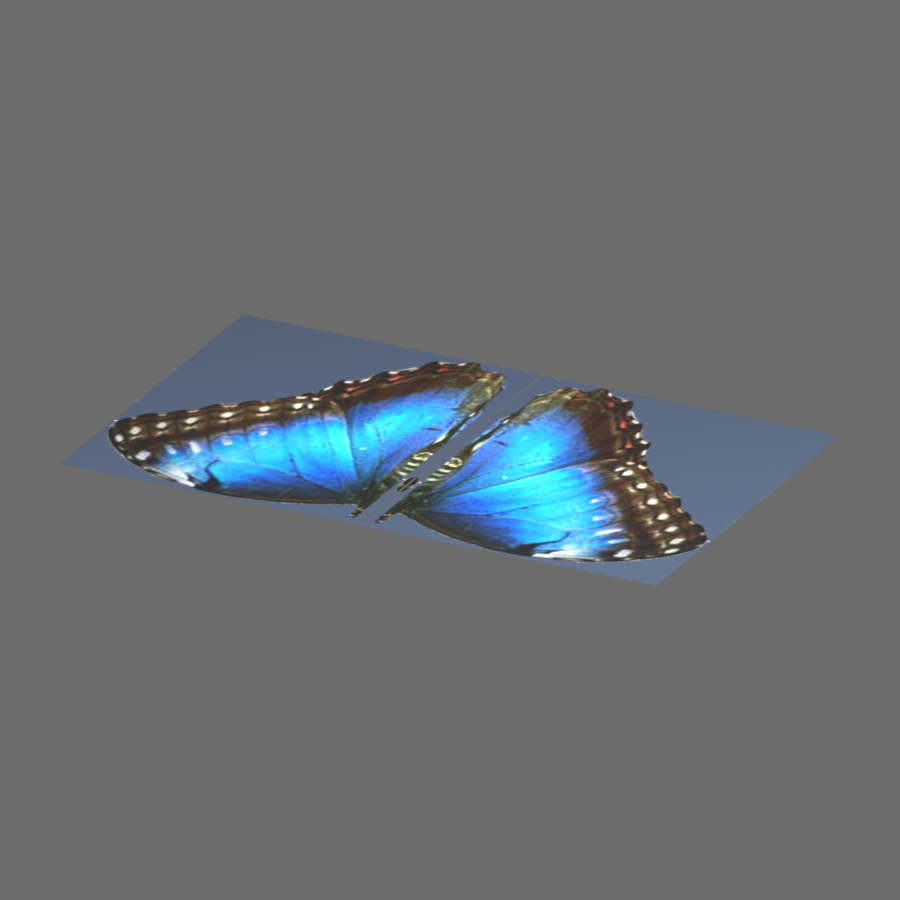

# Projections planaires et sphériques — v0.16.0

Le convertisseur C applique les projections d'images **LWOB et LWO2** en
espace objet, sans option supplémentaire. LWO2 n'est plus limité aux images
UV : `PROJ 0` et `PROJ 2` génèrent les coordonnées par coin pour OBJ et glTF.
Les paramètres et contours natifs restent en IR ; aucune subdivision ni
modification de l'objet original n'est imposée.

## Paramètres pris en charge

| Paramètre | LWOB | LWO2 | Interprétation |
| --- | --- | --- | --- |
| Type de projection | Planar/Spherical Image Map | `PROJ 0/2` | Plan ou sphère |
| Axe X/Y/Z | Bits de `TFLG` | `AXIS` | Tous les axes |
| Centre | `TCTR` | `TMAP/CNTR` | Translation en espace objet |
| Taille | `TSIZ` | `TMAP/SIZE` | Échelle planaire, y compris négative ; taille ignorée pour la sphère |
| Orientation | Pas de rotation dans ce profil LWOB | `TMAP/ROTA` | Heading, pitch, bank en radians |
| Répétition sphérique | `TFP0/TFP1` | `WRPW/WRPH` | Appliquée après traitement de la couture et des pôles ; valeurs fractionnaires, nulles ou négatives admises |
| Comportement hors image | `TWRP` | `WRAP` | Reset, repeat, mirror, edge ; axes indépendants |

La taille inutilisée sur l'axe de projection planaire peut être nulle. Une
taille nulle sur un axe effectivement projeté bloque la liaison, avec diagnostic.
La projection sphérique emploie la direction relative au centre : même une
taille anisotrope ne déforme pas ses UV dans les mesures natives.

Les matériaux conservent les contraintes de composition du
[profil texture](textures.md) : une couche active par canal pour LWO2,
blend normal à 100 %, images décodables et mappings compatibles entre canaux.
La vérification de compatibilité compare désormais aussi le type de projection
et la rotation. Deux blocs `IMAP` de projections ou rotations différentes
ne sont plus assimilés à un seul mapping.

## Mesures natives et corrections

Le [probe facultatif](../tests/probe_texture_projection.py) construit un helper
isolé depuis le code de capture et un SDK installé. Il utilise **Texture
Functions / evaluateUV** dans LightWave 6 (build 446) et 9.6 (build 1539), sans
modifier le convertisseur ni le helper distribué. Le moteur de conversion
reste entièrement autonome.

Les [300 observations enregistrées](../tests/fixtures/texture_projection_oracle.json)
couvrent les deux projections, trois axes, centres décalés, rotations combinées,
tailles anisotropes/négatives et répétitions. Ce sont des couches créées par
l'API native, pas des UV attendus calculés par notre propre implémentation.
Les tests produisent ensuite de vrais fichiers LWOB/LWO2, les convertissent
et décodent leurs buffers glTF ainsi que leurs coordonnées OBJ.

Les mesures ont révélé trois erreurs dans le calcul sphérique précédent :
l'orientation de longitude sur X, la position de couture sur Y, et l'application
de la taille. Ces trois points sont corrigés pour LWOB comme pour LWO2.

La transformation d'une texture LWO2 est distincte de la rotation d'un item
de scène. Pour un point moins le centre, les coordonnées de texture suivent
`Rx(-P) × Ry(H) × Rz(-B)`, puis la division par la taille pour le plan.
Les noms et unités des paramètres viennent de la
[spécification LWO2 du SDK](../extern/lwsdk-master/html/filefmts/lwo2.html#Hs_tmap) ;
la convention de calcul a été vérifiée par
[l'API native documentée](https://documentation.help/LightWave/txtrfunc.html).

Le traitement des coins déroule la longitude avant d'appliquer la répétition.
Un pôle emprunte la longitude moyenne des autres coins du polygone, ce qui
évite de tirer toute une face vers une longitude arbitraire. LightWave 9.6
réduit les UV de l'API modulo un, contrairement à plusieurs cas LW6 ; les
comparaisons tiennent compte de cette équivalence pour l'adressage repeat.
Le comportement des pôles est testé séparément.

## Hors image et conservation

Le repeat ordinaire conserve son image et ses UV non bornés. Pour les autres
modes, le convertisseur produit une image dérivée commune aux exports OBJ/glTF :

- **Mirror** : deux tuiles, dont une réfléchie, puis répétition de l'ensemble.
- **Edge** : prolongement des pixels du bord sur le domaine UV utilisé.
- **Reset** : pixels noirs hors image avant les opérations de matériau.

Le domaine inclut les coordonnées des coins concernés et une marge de filtrage.
Un remappage affine des UV conserve l'interpolation sur les triangles sans
changer la géométrie. Le champ IR `materials[].derived_texture_mapping` décrit
le minimum et l'étendue du domaine d'origine ; les valeurs natives `wrap`,
`size`, `center`, `rotation` et `tiles` restent distinctes.

L'atlas reste limité à **16 384 pixels par axe et 16 777 216 pixels au total**.
Un domaine trop grand ou des UV invalides entraînent un diagnostic explicite,
sans allocation excessive ni fausse liaison. Les noms lisibles, hashes et
copies de textures suivent le mécanisme de publication existant.

Le filtrage/mipmapping final et le shader restent des approximations du rendu
LightWave. Les tests vérifient les 16 combinaisons de wrap sur les deux axes,
dans les deux formats sources, y compris les coordonnées négatives et les
échantillons hors image. Ils vérifient aussi les limites d'allocation.

## QA du corpus

Le [rapport reproductible](diagnostics/projections-20260914-qa.json) compare
le batch 0.15.1 à une conversion 0.16.0 de **103 objets**, dont les LWO2
contenant une projection planaire/sphérique et les contrôles Orange Juice/Aircon.
Chaque source a été vérifiée par SHA-256 contre le batch archivé.

| Mesure | Résultat |
| --- | ---: |
| Nouveaux blocs liés à une image dérivée | **97** |
| Objets gagnant au moins une liaison | **55** |
| Liaisons existantes perdues | **0** |
| Matériaux utilisant un atlas de wrap | 45 |
| Blocs LWO2 planaires/sphériques examinés | 166 : 164 plans, 2 sphères |
| Blocs encore préservés sans application | 69 |
| Échecs de conversion | 0 |

Les 69 obstacles restants sont : canaux non exportés (29), images introuvables
ou indécodables (22), blend/opacity hors profil (10), attribut `STCK` (6),
plusieurs couches actives (1) et paramètres animés (1). Aucun de ces 69 blocs
n'est encore refusé pour sa projection planaire ou sphérique.

Sortie à examiner :
`output/qa-projections-20260914/batch-20260914-085207/packages/`.
Par exemple, `butterfly-tank/gltf/butterfly.lwo.gltf` retrouve ses deux
textures d'ailes et `demo-redline-assets-main/gltf/mesh_resto.lwo.gltf`
exerce plusieurs mappings avec reset/edge.



Validation :

- **12 groupes de régression** passent en Release et AddressSanitizer ;
  [tests des projections](../tests/test_projections.py) et
  [tests des textures](../tests/test_textures.py).
- **103 glTF**, zéro erreur et zéro avertissement au
  [validateur Khronos](diagnostics/projections-gltf-validation.json).
- Imports OBJ et glTF depuis des répertoires isolés dans Blender 4.2 :
  [Butterfly](diagnostics/projections-butterfly-blender.json),
  [Orange Juice](diagnostics/projections-orange-blender.json) et
  [Redline](diagnostics/projections-redline-blender.json).

Ces imports vérifient images chargées, liaisons de matériaux et UV. L'aperçu
emploie un éclairage de diagnostic ; ce n'est pas une comparaison exhaustive
du rendu LightWave. Les clip maps du papillon ont ensuite été traitées en
[v0.17.0, avec une nouvelle QA du détourage](clip-maps.md).

## Limites indépendantes de la projection

Le profil est **statique et en espace objet**. Les coordonnées monde,
objets de référence LWS, falloff et enveloppes de texture sont conservés mais
ne sont pas évalués. L'animation de ces paramètres demande un autre mécanisme
de bake ou un shader cible. Les projections cylindriques, cubiques et frontales
restent hors profil.

La sphère est échantillonnée aux coins et interpolée par les triangles du
format cible. Une grande face peut donc différer d'un calcul sphérique par
pixel dans LightWave ; aucune subdivision automatique n'est ajoutée. Les
cartes de hauteur, couches procédurales, clip maps et blends non pris en charge
ne deviennent pas fonctionnels simplement parce que leurs UV sont calculables.

## Reproduction

```powershell
cmake --build build --config Release
ctest --test-dir build -C Release --output-on-failure
python -X utf8 documentation/diagnostics/check_projection_corpus.py --baseline output/batch-20260913-221149 --output output/qa-projections-new --report documentation/diagnostics/projections-new.json
python -X utf8 tests/probe_texture_projection.py --output _tmp/texture-oracle-new96 --sdk _tmp/_extern/LightWave/LW9/SDK --lightwave-root _tmp/_extern/LightWave/LW9.6
python -X utf8 tests/probe_texture_projection.py --output _tmp/texture-oracle-new6 --sdk _tmp/_extern/LightWave/LW9/SDK --runtime lightwave6 --lightwave-root E:/__very_old_stuff_/archive-stuff_cd/LW6/Programs/LightWave_Support
```

Le script de corpus accepte `--analyze-existing` pour analyser le batch déjà
produit sous `--output`. Pour AddressSanitizer sous MSVC, ajouter le dossier
du runtime `clang_rt.asan_dynamic-x86_64.dll` au `PATH` de la commande de test.
Le build Release actualise automatiquement `bin/win64/lwconvert.exe` ; le
batch habituel bénéficie donc de ce support sans LightWave installé.
