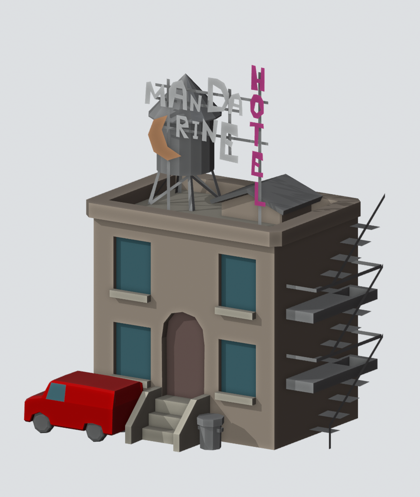

# Van OBJ triangulation diagnosis

Validated on 10 September 2026 with converter v0.1.1.

Source: `content/mandarine-000-lw5/template/van.lwo`, SHA-256
`a34536c16f89bda4b95a90a1e6e8dcfca7740433b16d3a31f836d617e8d4d368`.
Despite its name, this object contains the van, building, signs and fire escape.
It has 1,236 points and 798 native FACE polygons, including 26 polygons with
more than four corners.

## Diagnosis

The v0.1.0 OBJ writer passed n-gons through unchanged. A triangle fan does not
respect their concave boundaries: the front wall covers part of the recessed
door, while strokes in the HOTEL sign disappear or become filled. A controlled
fan reproduction matches those defects in the supplied screenshot. The native
door has an arched top; it is not a rectangular opening.

A separate writer limitation removed every polygon with repeated point indices.
Three such records in this object encode holes by walking a bridge in both
directions. They are meaningful contours, not polygons to discard:

| Native primitive, zero-based | Geometry | Corners | Corrected triangles |
|---|---|---:|---:|
| 450 | H in HOTEL | 12 | 10 |
| 451 | O in HOTEL, with an inner opening | 18 | 16 |
| 452 | T in HOTEL | 8 | 6 |
| 453 | E in HOTEL | 12 | 10 |
| 454 | L in HOTEL | 6 | 4 |
| 554 | Front wall around the arched door | 15 | 13 |
| 557 | Recessed door | 11 | 9 |
| 737, 738 | Fire-escape platforms with openings | 10 each | 8 each |

## Correction

`src/triangulate.c` clips ears from a normalized 2D projection of each ordinary
FACE boundary. Paired reverse edges retain bridged holes. The output references
source corners, preserving UV bindings and orientation through the OBJ basis
conversion. Triangles are emitted explicitly, with source polygon IDs in comments.
The native source file, point arrays, polygon boundaries and maps remain unchanged
in the LWIR package. No Blender addon or runtime dependency was added.

The corrected object produces **1,592 triangles**. Eight other source quads
(739, 741, 743, 745, 747, 749, 751 and 753) each collapse to two distinct positions
and have zero area. They are reported and omitted from OBJ, while their original
records remain in LWIR. Nonplanar faces are reported as projected approximations.



This preview uses Blender 4.2 Workbench and approximate MTL colors. It validates
the recovered silhouettes and openings; it is not a LightWave reference render.

## Validation and limits

All 26 n-gons produce `n-2` triangles. Their projected triangle areas sum to the
signed boundary area, their orientation follows the source winding after basis
conversion, and four interior samples per triangle remain inside the source
winding region. The O and both platform openings remain empty.
Source bytes and `geometry.bin` match the v0.1.0 package exactly.

The automated suite now has 25 converter tests and seven batch tests. New cases
cover concave n-gons/quads, clockwise and counterclockwise input, one or multiple
bridged holes, VMAD overrides, scale, explicit closing corners, invalid contours
and nonplanar faces. Release and AddressSanitizer checks pass.

The native triangulator was also exercised on all 915 loose objects and two
presets: 1,304,905 eligible FACE records, with no AddressSanitizer diagnostics.
This is a memory/access and coverage check, not a claim that all contours are
supported. The conservative profile reports 7,385 omitted degenerate or
unsupported contours across that corpus, and 406,172 successfully triangulated
nonplanar faces. It recovers 294 of the 1,031 FACE records with repeated indices.
The remaining cases require separate interpretation; source records stay intact.

See the [machine-readable report](diagnostics/van-triangulation-check.json) for
per-n-gon areas and aggregate corpus results. `triangulation_probe`, built when
testing is enabled, accepts one UTF-8 object path per stdin line and emits JSON
records without creating export packages.

Existing batch output is not rewritten. Build v0.1.1 and rerun the batch to
generate new packages, or convert this object alone:

```powershell
cmake --build build --config Release
build/Release/lwconvert.exe convert content/mandarine-000-lw5/template/van.lwo --content-root content/mandarine-000-lw5 --output output/van-new
```

The review export created during this diagnosis is available at
`output/van-triangulation-0.1.1/van.obj`, with `materials.mtl` beside it.
Its package manifest reports the triangulation counters and remaining limitations.
